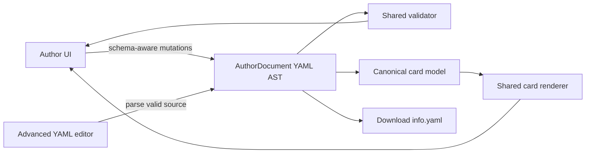

# Author page design

## Purpose

Make card authoring possible without editing YAML while preserving the existing raw `info.yaml` workflow for advanced users.

The central path is a visual **Author page**. It starts as a recognizable card page, lets an author enter Edit mode, and turns card components and documented optional fields into direct editing affordances. The output remains a canonical `info.yaml` that can be downloaded and submitted in a pull request.

This is an authoring tool, not a second metadata format. `releases/*/info.yaml` remains the source of truth.

## Implementation status

**MVP implemented:** `/preview/new/` now provides visual editing for required card metadata, distinct short-description/summary fields, tags, panel controls and sockets, switch actions, the documented inline `readme`, contact, and licensing. It renders through the shared canonical model and card renderer, supports direct panel-component selection, persists a local draft, generates live schema diagnostics, downloads `info.yaml`, and retains an Advanced YAML mode. The existing `/preview/` YAML workflow remains available and links to the new author page.

**Still planned:** visual editing of existing cards, YAML AST/comment-preserving round trips, undo/redo, richer documentation-section ordering, visual media/UF2 editors, explicit draft restore/discard UI, and optional pull-request integration.

## Product principles

1. **Start with the result.** A new author first sees the card page they are creating, not a schema or empty text editor.
2. **Direct manipulation.** Select the panel component or document section that needs content.
3. **Progressive disclosure.** Ask for required identity fields first; expose structured and uncommon fields only when relevant.
4. **One source, two editing modes.** Visual Author mode and Advanced YAML mode edit the same in-memory YAML document.
5. **Never hide the panel.** The physical panel remains visible while editing every panel-related field.
6. **Publishable by default.** New Basic-mode cards begin with `draft: false`; required-field validation makes incomplete work explicit.
7. **No silent data loss.** Switching modes must retain unknown fields, comments, and ordering where possible.
8. **Licensing and etiquette are distinct.** A license grants legal permissions. Community requests such as “please ask before publishing a port” are displayed separately and must not be presented as license restrictions.

## Information architecture and routes

### Recommended routes

| Route | Purpose |
| --- | --- |
| `/preview/new/` | New-card happy path. Opens a blank draft in Author mode. |
| `/preview/#<slug>` | Existing-card preview. Opens the selected card in Author mode. |
| `/preview/#<slug>?mode=yaml` | Optional shareable advanced-mode state. Prefer a query parameter before the hash if deployment routing makes this awkward. |

Generate a real `site/preview/new/index.html` so `/preview/new/` works on static hosting without rewrite rules. It may use the same page shell and client modules as `/preview/`, with a boot flag such as `data-author-document="new"`.

Do not introduce a server dependency. The site is static today, and all state construction can happen safely in the browser. “Back end” in this design means the author-document/state layer behind the UI, not a network service.

### Existing preview migration

- Rename the visible experience from **Card author preview** to **Author page**.
- Default to **Author** mode.
- Keep the card selector for existing cards.
- Move the current editor and diagnostics into **Advanced YAML** mode.
- Preserve deep links, live validation, UF2 completion, download behavior, and preview interactions.

## New-card first-run flow

1. Open `/preview/new/`.
2. See a blank card page with the Workshop Computer panel and placeholder content.
3. A compact setup card asks for the seven required schema fields:
   - Name
  - Short description
  - Summary
   - Language
   - Creator
   - Version
   - Status
4. Required fields use a visible `Required` marker and are summarized in a completion checklist.
5. Select **Edit card** to enter Edit mode.
6. Select panel controls/jacks or an **Add section** tile to fill out structured metadata.
7. Select **Add license** to use the license assistant or choose a known license directly.
8. Review validation and the rendered result.
9. Select **Download info.yaml**. A secondary **What next?** panel explains where the file belongs and links to contribution instructions.

The initial document should be equivalent to:

```yaml
draft: false
Name: ""
short-description: ""
summary: ""
Language: ""
Creator: ""
Version: ""
Status: ""
```

Empty optional structures should not be serialized. Required empty values may remain in the working document but the download action should warn before exporting an incomplete file.

## Page modes

### View mode

- Renders the card as it will appear on the published site.
- No editing chrome except the top author toolbar.
- Primary action: **Edit card**.
- Secondary actions: **Advanced YAML**, **Download info.yaml**, and completion status.

### Edit mode

- Keeps the rendered card page as the canvas.
- Adds dotted outlines and edit badges to editable regions.
- Selecting a region opens a contextual inspector beside it or in a right-side drawer.
- Empty optional sections appear as compact “Add …” tiles, not as full blank forms.
- A top toolbar provides **Done editing**, undo, redo, completion, and download.

### Advanced YAML mode

- Retains the current raw editor, line gutter, diagnostics, auto-indent, and UF2 path suggestions.
- Uses a resizable split view: YAML on one side, published preview on the other.
- The preview panel must be docked inside the preview column rather than positioned outside its clipping container.
- Returning to Author mode reparses the YAML. Syntax errors keep Advanced mode active and explain that visual editing resumes after the YAML is valid.

## Persistent panel design

The current panel rail uses a negative left margin and lives outside the article content. Inside the preview’s independently scrolling column, that rail can be clipped or placed outside the visible column.

### Author-mode panel dock

Use an author-page-owned panel dock rather than relying on the public page’s outside rail:

- Desktop: a fixed/sticky panel column inside the author canvas, approximately 280 px wide.
- The document content scrolls independently beside it.
- The panel remains visible from hero through documentation.
- Selecting a panel component highlights the same component in the dock and opens its inspector.
- Switch-position controls remain attached to the panel.
- If an inspector opens, the panel and inspector share the dock instead of covering document content.

### Narrow screens

- Collapse the dock into a sticky top panel tray.
- The tray can minimize to a labeled handle but must not disappear.
- Opening a panel-component editor expands the tray automatically.
- Avoid duplicate interactive panel copies. Hide the normal in-document panel while the dock is active.

### Advanced-mode panel

The Advanced YAML preview needs a local layout override:

- Disable the negative-margin `.program-card-panel-rail` presentation inside the preview.
- Place the rail in a visible sticky column within `#card-preview` or render an author-specific dock from the same panel snapshot.
- Do not rely only on the existing viewport-width media query; the relevant width is the preview container, not the browser viewport.
- Prefer a container query on the preview canvas where supported, with a conventional fallback.

## Direct editing model

### Editable regions

| Visual region | YAML target | Interaction |
| --- | --- | --- |
| Title/summary hero | `Name`, `summary` | Inline text fields |
| Discovery tagline | `short-description` | Inline text field |
| Creator and facts | `Creator`, `Language`, `Version`, `Status` | Compact metadata inspector |
| Tags | `tags[]` | Token picker/free entry |
| Main/X/Y knobs | `controls.knobs[]` | Component inspector |
| Switch positions | `controls.switch.up/middle/down/tap` | Position tabs plus name/description |
| Inputs | `panel.inputs[]` | Select physical jack, edit name/description/type |
| Outputs | `panel.outputs[]` | Select physical jack, edit name/description/type |
| LEDs | `controls.leds[]` | LED list editor with switch-position context |
| Inline README | `readme` | Markdown editor; replaces rendered README.md |
| Video/audio | `demo-link`, `audio-sample` | URL/file-path fields with preview |
| Downloads | `uf2[]` | Repository path or external-download editor |
| About | core metadata, `contact`, `License` | Metadata inspector |

### Panel component interaction

1. Hover/focus reveals the physical component name and current authored role.
2. Select a component to open its inspector.
3. Choose whether the meaning applies to **All positions**, **Up**, **Middle**, or **Down**.
4. Enter display name, short description, and operator summary.
5. The state layer writes an unconditioned base entry for All positions or a `when: { z: ... }` override for a position.
6. The preview updates immediately and retains the selected switch position.

Only expose Up/Middle/Down. `tap` belongs to switch actions and must never appear as a panel view.

### Optional detail tiles

At the end of each logical area, show an **Add section** tile. Its menu offers only schema-supported sections:

- Inline README
- Demo video
- Audio sample
- Host/USB notes
- Contact details
- Firmware download

Added sections can be reordered where order is meaningful. Removing a populated section requires confirmation and supports undo.

## Required-field treatment

The schema adapter is the authority; do not duplicate the required-field list in UI code.

- Render a `Required` badge next to required fields.
- Empty required values use a clear but non-alarming incomplete state.
- Toolbar status: **3 of 7 required fields complete**.
- Completion drawer groups findings into:
  - Required before download
  - Recommended before publishing (`License`, `contact`, and `panel` when ending draft)
  - Optional enhancements
- Validation messages link to and focus the corresponding visual editor.
- **Download anyway** remains available for drafts after a confirmation; drafts are legitimate work in progress.

## License assistant

### Entry point

Show **Add license** in the About area and completion drawer when no license exists. If a license exists, show **Review license**.

The modal must begin with:

> This assistant explains common choices and records your selection. It is not legal advice. Confirm that all included code, libraries, documentation, samples, and hardware designs are compatible with your choice.

### Step 1: what is being licensed?

Ask which materials the contribution contains:

- Firmware/software
- Documentation
- Hardware design files
- Audio or other media

The current `License` field records the primary software/card license. If multiple material types need separate licenses, the assistant should explain that separate license files or notices may be needed rather than pretending one identifier covers everything.

### Step 2: existing obligations

Ask:

- Is this derived from another project?
- Does it include third-party code or libraries?
- Is an upstream license already specified?

If yes, show a compatibility warning and recommend preserving the upstream license/notices. Do not offer to override an inherited copyleft license.

### Step 3: legal permission goals

Use plain-language questions:

1. May others use, modify, and redistribute the code?
2. May they distribute closed-source versions?
3. Must distributed derivatives remain under the same open-source license?
4. Do you want to dedicate your own rights as broadly as possible to the public domain?
5. May others use the work commercially?

Suggested outcomes for the initial supported set:

| Answers | Suggested primary choice |
| --- | --- |
| Broad reuse, closed-source derivatives allowed, retain notice | `MIT` |
| Derivatives must remain open under the same terms | `GPL-3.0-or-later` |
| Broad public-domain-style dedication | `CC0-1.0` with a warning that software patent treatment differs from common software licenses |
| Commercial use forbidden or public redistribution requires individual permission | No automatic open-source recommendation; explain that this is not OSI open source and requires a maintainer-approved source-available/custom policy |
| Unsure or inherited work | **I need help / keep draft** |

Do not recommend Creative Commons licenses for software merely because they contain “non-commercial” terms. For documentation/media, a later expanded assistant may offer `CC-BY-4.0` or `CC-BY-SA-4.0`; for hardware design files it may offer an approved CERN OHL choice after project maintainers define policy.

### Step 4: community etiquette preferences

Present the screenshot-inspired scenarios separately from legal permissions:

- Someone publishes a VCV Rack version of my card.
- Someone publishes and sells a plugin version.
- Someone publishes and sells a hardware version.
- Someone makes a public fork or port to another system.

For each, allow:

- Please contact me first
- No need to ask; please credit me
- No need to ask
- I am not comfortable with this

Explain when a preference conflicts with the selected license. For example, MIT legally allows commercial ports without asking; “Please contact me first” can be displayed as a courtesy request, not a condition.

Do not serialize these answers into `notes`. That would mix authoring guidance with operator documentation. Before implementation, choose one of:

1. add a dedicated optional schema object such as `community_preferences`, or
2. keep the answers local to the assistant and use them only to explain the selected license.

Recommendation for the first release: option 2. Add schema only after maintainers agree where and how preferences should be published.

### Step 5: confirmation

Show:

- selected SPDX identifier
- short plain-language summary
- permissions and obligations
- compatibility/inherited-code warnings
- links to the authoritative license text
- **Use this license** and **Choose manually** actions

On confirmation, write the SPDX identifier to `License`. The first release should not generate a full `LICENSE` file because copyright holder/year, dependency notices, and multi-material licensing need deliberate handling. It may provide a checklist for adding or confirming the repository license file.

### Initial manual picker

Offer the licenses already established in this repository first:

- MIT
- GPL-3.0-only
- GPL-3.0-or-later
- CC0-1.0

Normalize legacy display values when selected, but do not rewrite an existing unknown value without confirmation.

## State and serialization architecture

### Author document

Introduce an `AuthorDocument` layer used by both modes:

- owns the current `yaml.Document`
- exposes schema-aware get/set/remove operations
- emits parsed raw data for validation
- emits the canonical card model for rendering
- serializes the exact downloadable YAML
- maintains undo/redo transactions
- reports dirty state and mode-switch safety

Use the `yaml` package’s document/node APIs for structured edits so existing comments, key order, and unknown fields survive visual changes. Avoid rebuilding YAML from the normalized card model.

### State pipeline



For new cards, initialize a fresh document. For existing cards, initialize from the literal raw source artifact so comments and formatting are retained.

### Rendering hooks

Do not fork the production card renderer wholesale. Add optional authoring metadata/hooks:

- stable `data-author-field` attributes on editable regions
- stable `data-author-component` identifiers on panel controls and sockets
- optional empty-state slots when `authorMode` is enabled
- a panel rendering entry point usable by the author dock

The normal public renderer should emit no editing controls.

## Components/modules

Suggested source organization:

- `src/render/authorPage.js` — shared Author page shell
- `assets/author/author-client.js` — route and mode orchestration
- `assets/author/author-document.js` — YAML AST state, transactions, serialization
- `assets/author/author-inspectors.js` — schema-driven field and component inspectors
- `assets/author/license-assistant.js` — deterministic question flow and recommendations
- `assets/author/author.css` — author canvas, dock, edit affordances, responsive behavior
- existing `assets/preview/preview-client.js` — migrate reusable interactions, then reduce to a compatibility entry point if appropriate

## Accessibility

- All click-to-edit affordances must also be buttons reachable by keyboard.
- Panel components need accessible names such as “Edit CV input 1”.
- Selection and validation updates use restrained `aria-live` announcements.
- Modal focus is trapped and returned to **Add license** on close.
- Required status is conveyed in text, not only color.
- Edit outlines meet contrast requirements.
- The panel tray must not create a keyboard trap or obscure focused content.
- Respect reduced-motion preferences when scrolling to fields or opening inspectors.

## Validation and failure states

- Invalid visual input is blocked or explained at the field level.
- Cross-field/schema diagnostics still come from the shared validator.
- An Advanced-mode YAML syntax error does not destroy the last valid rendered state; show it as stale with a clear banner.
- Before navigation or card switching, warn if there are unsaved edits.
- Store a recoverable local draft in `localStorage`, keyed by new card or source slug, with explicit **Restore** and **Discard** choices.
- Never upload source automatically.

## Delivery phases

### Prerequisites

- Add browser-level coverage for author routes and responsive panel visibility; the current preview has no dedicated automated UI tests.

### Phase 1 — layout and parity

- Rename to Author page and add Author/Advanced modes.
- Fix the persistent panel in the existing advanced preview.
- Add `/preview/new/` and initialize the minimal draft.
- Add `AuthorDocument` with download, dirty state, local recovery, and mode synchronization.
- Render required-field progress.

### Phase 2 — no-code core

- Visual editors for required metadata, tags, contact, and About fields.
- Clickable panel controls, inputs, outputs, switch positions, and LEDs.
- Add/remove/reorder documentation tiles.
- Undo/redo.

### Phase 3 — license and publishing readiness

- Implement license assistant and manual picker.
- Add completion drawer and download readiness checks.
- Add contribution-next-steps guidance.
- Confirm project policy for community etiquette preferences and multi-material licensing.

### Phase 4 — polish and optional PR integration

- Media and UF2 visual editors.
- Import an arbitrary local `info.yaml`.
- Optional GitHub-assisted “Open a PR” flow, designed separately because authentication and repository permissions change the security model.

## Acceptance criteria

1. A first-time author can create and download a schema-valid minimal `info.yaml` without seeing YAML.
2. Every required field is visibly identified, and completion state derives from the schema adapter.
3. Selecting any physical panel component edits the corresponding canonical author-schema entry.
4. Up/Middle/Down overrides produce the same panel views as the production build.
5. The panel remains visibly available in Author mode and Advanced YAML mode at desktop and narrow widths.
6. Advanced YAML edits and visual edits round-trip without dropping unknown fields or comments.
7. Invalid YAML cannot be overwritten by visual-mode serialization.
8. The license assistant clearly distinguishes legal permissions from etiquette preferences and writes a normalized SPDX identifier only after confirmation.
9. Downloading an incomplete draft is possible only after a clear warning; no work is trapped in the browser.
10. Existing `/preview/#<slug>` deep links and shared validator/render behavior continue to work.

## Decisions needed before implementation

1. Should existing-card `/preview/#<slug>` open Author mode by default immediately, or should the first release keep Advanced YAML as its default while `/preview/new/` uses Author mode?
2. Should community etiquette preferences remain assistant-only in the first release, or should the schema gain a publishable `community_preferences` block?
3. Is the initial approved license set MIT, GPL-3.0-only, GPL-3.0-or-later, and CC0-1.0, or should maintainers approve documentation/hardware licenses now?
4. Should the download action provide only `info.yaml`, or a ZIP containing `info.yaml`, a contribution checklist, and optionally license guidance?
5. Should local draft recovery expire automatically, and if so after how long?
