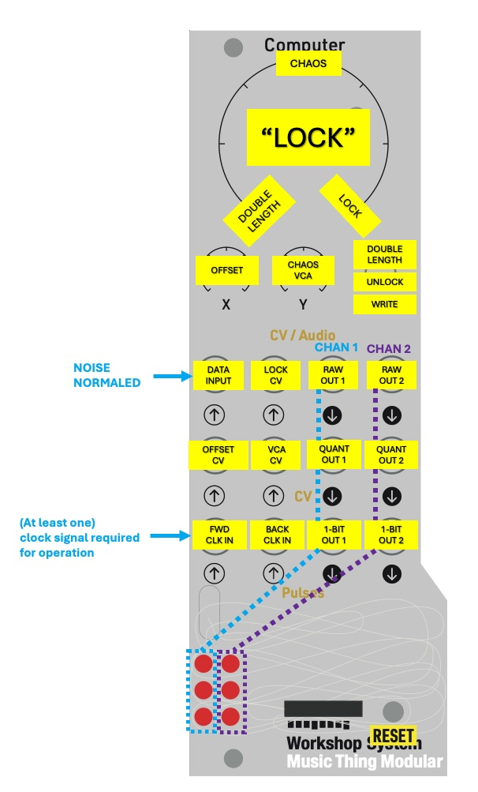

#BYO_Benjolin Computer Card

Along with the other elements in the Workshop System, this card provides the opportunity to Build Your Own Benjolin or a completely different chaotic instrument of your choice.

Without any external data input, the BYO_B behaves like a 6 (or 12) step turing machine using an internal noise source. The shift register here has 2-bits in each cell (0,1,2, or 3 in each cell instead of just 1/0) which gives this card its own voice.

Plug a Sine or Triangle VCO into the data input and modulate the frequency of that oscillator with RAW OUT 1 or 2. Monitor the VCO (optionally filtering / ring modulating) and you have a strange Benjolin implementation but maybe you can make it even weirder?

Simultaneously clocking the FWD and BACK CLK inputs will result in halted / glitchy fun

Audio rate clock encouraged but not for the faint of heart.

**A big thank you to Tom Whitwell, Chris Johnson, and Rob Hordijk**

