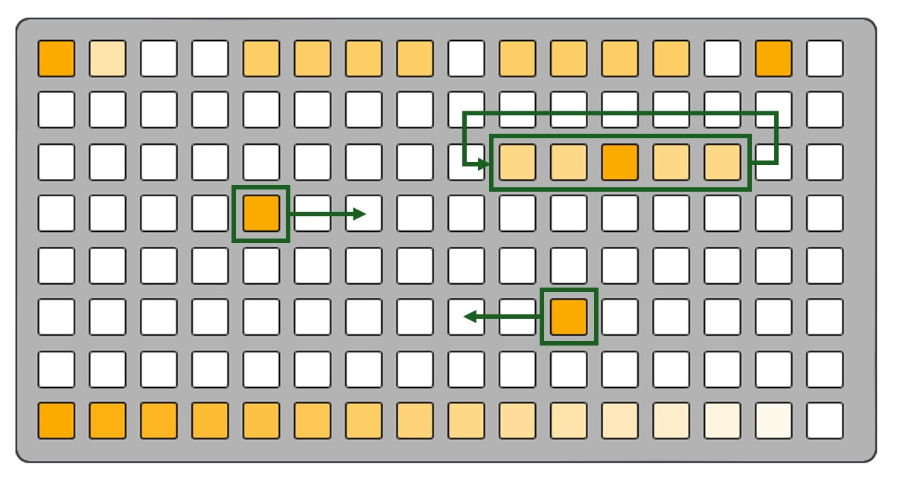
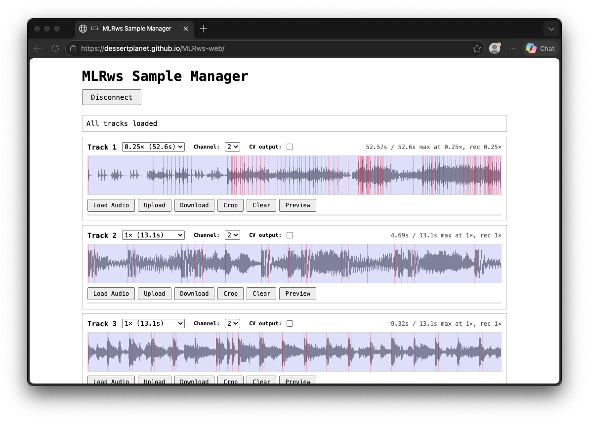

# MLRws

MLRws is a remix of the classic MLR [grid](https://monome.org/docs/grid/)-based performance-oriented sample-cutting instrument originally developed by [tehn](https://nnnnnnnn.co) at monome as a Max MSP patch and subsequently ported to [norns](https://github.com/tehn/mlr). MLR has had many generations and was one of the original instruments implemented for the grid interface, as evidenced by this great video of tehn [performing on a grid prototype in 2007](https://hyper8.monome.org/tehn-with-monome-prototype/). In a way that is relatively unique to electronic instruments, MLR also has several virtuoso instrumentalists who have spent years learning its ins and outs such as [Daedelus who you can see absolutely shredding in this KEXP video](https://www.youtube.com/watch?v=Z_zIvFYQWig)

MLRws is my own six-track, grid-optional spin on MLR that works within the constraints of the Workshop Computer and also gave me an oppotunity to demonstrate a few things that I hadn't tried yet on the Computer and provide example code for these things, namely:

- Sample storage, recording, and playback using the on-card flash. This allows busting out of those [goldfish](https://youtu.be/pdzMC6afrHY?si=pfhao3fF60Qi6n61)-style time limits.

- [ADPCM](https://en.wikipedia.org/wiki/Adaptive_differential_pulse-code_modulation-based) audio encoding, further reducing the number of bits needed to store a sample of audio (technically MLRws stores 4-bits per sample). This is the same tech that Brian Dorsey's excellent [Backyard Rain](https://github.com/TomWhitwell/Workshop_Computer/tree/main/releases/42_backyard_rain) card uses for playback. I also noticed working on this project that ADPCM has additional compression, saturation, and noise-removal characteristics that I kind of love the sound of.

- USB Serial host-mode communication with a monome or DIY grid device via the monome mext [serial protocol](https://monome.org/docs/serialosc/serial.txt). You plug a grid right into the front of the computer. I'm hoping that the code for this problems can be leveraged to create more cards that have grid interfaces. [There is a detailed monome device protocol api doc here for those interested](docs/Computer_monome_api.md)

## Sample manager web app

You are going to need source materials on your MLRws travels. It is totally possible to record your own sounds via the audio input(s) on the module but you may also want to upload samples from your (non-workshop) computer. For this there is a basic [web app you can find right here](https://dessertplanet.github.io/MLRws-web/).

The web app automatically encodes your audio to the right format for MLRws, and there is a variable resampling/recording speed (equivalent to recording in grid mode at slower-than-1x) allowing you to trade fidelity for more maximum sample time per track. The table below shows the maximum sample time for the dual-mono firmware at each supported speed.

| Record speed   | Max per track |
|---------|--------|
| 1x      | 13.1 s |
| 0.667x  | 19.7 s |
| 0.5x    | 26.3 s |
| 0.25x   | 52.6 s |

Via the grid it is possible to record at faster than 1x but **you will encounter potentially interesting weirdness**- only recommended if you like strange digital noise. The resampling trips over itself and encodes who-knows-what.

[Detailed sample manager docs are here](docs/SampleMgr.md)

## Modes

MLRws has several modes of operation that are all determined by what is connected to the computer when it powers up. Each one has a subtly different startup LED animation so that you can tell what mode you're in.

Note that MLRws does NOT use [iii](https://monome.org/docs/iii), and any grid device should work. If you find your device does not work then please file a GitHub issue!

### Grid mode (USB host)

[Detailed grid docs are here](docs/Gridful.md)

The primary mode of MLRws is USB host with a grid device connected. This mode will be on you power-on the Workshop Computer (and/or system) with a grid plugged directly into the Computer via the USB-C port. Depending on your grid version you may need a specialized cable for this- older FTDI grids with USB Mini ports were tested using [this cable](https://www.amazon.com/dp/B00UUBS0SS?ref=ppx_pop_mob_ap_share) from amazon.

Note that the Workshop Computer determines whether it is in USB Host or USB Device mode when the module powers-on. so you may need to power-cycle your system to get into USB Host mode so that Computer can communicate with your grid.

### Grid mode (USB device)

In order to support the broadest-possible range of grid devices, MLRws has a Grid-interaction mode that uses exactly the same protocol as the host-mode but allows a different usb host. The primary use case for this would be using a norns device as a host running the midigrid mod that allows you to use alternative grid controllers. To do this you will also need my purpose-built [gridproxy](https://github.com/dessertplanet/gridproxy) mod, that passes grid device traffic over to the Workshop Computer. install the mod from maiden with `;install https://github.com/dessertplanet/gridproxy` and then restart norns.

Once you have your devices communicating, everything else is identical to the USB host grid mode. [The detailed grid doc applies here too.](docs/Gridful.md)

### Gridless mode (no USB device required)

I wanted to make MLRws fun even for folks who don't have a grid- and also thought it would be interesting to design an interface for 6 tracks of audio using only the things on the Computer panel. For this I consulted the discord community and some very wild ideas came in! Where this mode landed is something like if a minimal MTM Radio Music (thanks Tom!) and a Make Noise RxMx had a baby. It's weird and modulatable and fun! Oh and of course it has a built in Turing Machine since that is of the Workshop idiom (thanks again Tom!)

[Detailed gridless docs are here](docs/Gridless.md)

## Credits / Thank yous

A huge thank you to [tehn](https://nnnnnnnn.co) for the original MLR, the norns version of which MLRws is the closest sibling, for open sourcing the serial protocol used by grid and arc devices, and for your encouragement and support on this project.

Thank you to [Tom Whitwell](https://github.com/tomwhitwell) for the Workshop Computer and System, as well as Radio Music and Turing Machine that influenced the gridless mode.

Thank you to **Chris Johnson** for the ComputerCard framework on which this is built as well as explaining many many things to me.

Thank you to **Brian Dorsey** for proving that ADPCM is a cool option with his excellent Backyard Rain card.

Thank you to the many members of the Workshop Computer discord for their feedback, testing, time, ideas and patience! In no particular order, thank you to **@emho**, **@q*ben**, **@TSG**, **@philmillman**, **@gnomon**, and **@eclectics**.

Thank you to [Tyler Etters](https://github.com/tyleretters) for his excellent [GridStation](https://tyleretters.github.io/GridStation/) tool that was used heavily in the production of docs for MLRws.

Thank you to [Daedelus](https://www.instagram.com/daedelus/) for fielding my cold-message on instagram and providing some feedback on an early MLRws video. They are also responsible for the cool video in the intro.
