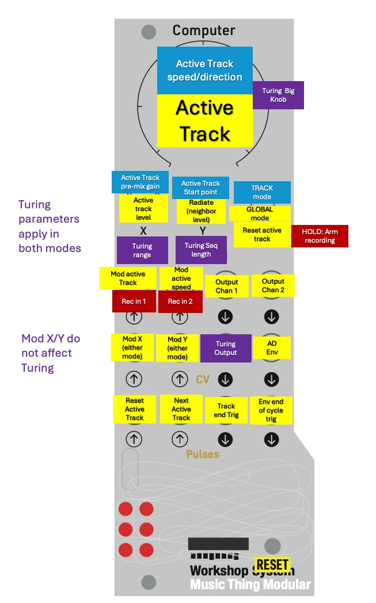

# Gridless mode

Gridless mode is what MLRws falls back to when the Computer powers up as a USB
device and nothing on the other end is talking to it (no grid, no
sample manager). The whole six-track instrument is driven from the Computer's
own panel — switch, three knobs, CV/Audio/Pulse jacks, and the six LEDs.



## At a glance

- Every track that already has audio on it **plays and loops continuously**.
  There is no start/stop — the panel only changes which track is "active" and
  how everything sounds.
- One track is always the **active track**. The panel's knobs and switch shape
  that track's playback (or, in global mode, shape the mix around it).
- The Main knob on the Computer is used to select the active track.
- The X knob sets the level of the current active track (this only ever applies to the **current** active track).
- The Y knob is an RxMx style "radiate" control that set the level of tracks **adjacent** to the active track. Y at 0 means only the active track plays (Radio Music style). Y at full means **all** tracks play at the level set by the X knob.
- **Audio Out 1 and Audio Out 2 are both active**: each track is routed to one
  of the two outputs based on its stored track (Audio Out 1 = track 1,
  Audio Out 2 = track 2). Tracks recorded in gridless mode inherit their
  track from the input jack used for the recording (see
  [Recording](#recording) below); tracks recorded in grid mode keep whatever
  track was selected there.


## Two switch positions, two roles for the knobs

The three-position switch picks the role of the knobs. 

### Switch Middle — Global mode

- **Main knob:** active-track select. The knob travels through tracks 1–6 left
  to right. Selecting a different active track is a mix action only; it does
  not reset any track's playhead.
- **X knob:** playback-layer gain. Centered = unity, fully left = silent, fully
  right = roughly +6 dB. This is a master-style gain that sits on top of every
  track's own volume slot.
- **Y knob:** *radiate*. Fully left, only the active track is heard. As you
  turn right, neighboring tracks fade in around the active one until, fully
  right, all six tracks are heard at the same level. Combined with Main
  sweeping the active track, this gives a soft cross-fade between tracks and
  a kind of swept ensemble.

### Switch Up — Track mode

Flipping the switch up **locks** the active track (it will no longer follow
Main), and re-tasks every knob to operate on that track:

- **Main knob:** bipolar **speed and direction** with a center deadzone.
  Center = muted hold; turning left plays reverse and turning right plays
  forward. The further from center, the faster, up to roughly ±2 octaves
  (¼× ↔ 4×) at the extremes. A small region near center mutes the track to
  give you a clean "stop".
- **X knob:** per-track volume 
- **Y knob:** **reset start position** for this track — picks the position
  the playhead will jump to when you trigger a reset (see
  [Switch Down](#switch-down) below). Setting Y while the track is playing
  doesn't move the playhead by itself; it stores the start position for the
  next reset.

### Switch Down

- **Tap:** reset the active track to its stored start position. Pulse Out 1
  emits a single trigger to echo the reset.
- **Hold and move Y:** when not armed or recording, moving Y after hard takeover
  sets the CV2 envelope attack time (instant to ~1 s). The attack setting is
  latched for future gates. The release time is read from Y when the gate
  releases.
- **Hold for two seconds:** arm record mode. While you hold the switch down,
  the LEDs fill from one to all six as a progress bar; at six LEDs you are
  armed and the active track's LED begins a slow flash. See
  [Recording](#recording) below.

## CV, Audio In, and Pulse modulation

The CV and pulse jacks add modulation on top of whatever the knobs and switch
are doing. CV ranges are the standard Workshop Computer ±6 V.

### Outputs

- **CV Out 1** is a clocked Turing-style pitch output. Pulse In 1 or Pulse In
  2 rising edges clock it. Main sets the probability/variation amount and X
  sets the range, so the output can move from a narrow pitch set to a wider
  chromatic span.
- **CV Out 2** is an ASR envelope. Pulse In 1 or Pulse In 2 rising edges clock
  the CV/Turing output and start the envelope attack; the envelope sustains
  while either pulse input remains high, then releases when both are low.
  Switch Down + Y sets attack time (instant to about 1 second); Y at release
  time sets release time (about 10 ms to 3 seconds).
- **Pulse Out 1** emits a short trigger when any playing track wraps back to
  the start of its loop/playback span.
- **Pulse Out 2** emits a short trigger when the CV2 envelope reaches the end of its release cycle.

### Inputs

- **CV In 1** adds to the **X knob** (after the panel value, before the X-knob
  role kicks in). So in global mode it modulates playback-layer gain; in
  track mode it modulates the active track's volume slot. While a CV is
  patched, hard-takeover is bypassed on that knob so the CV can take over
  smoothly.
- **CV In 2** adds to the **Y knob** the same way — radiate in global mode,
  start-column in track mode.
- **Audio In 1**, when patched, offsets the active-track selection by an
  audio-driven amount (0..6 tracks, full-scale). This wraps around the six
  tracks, so loud audio sweeps the active track through the rotation. Useful
  for envelopes, LFOs, or rhythmic triggers feeding the track select.
- **Audio In 2**, when patched, modulates the active track's **playback
  speed**, always forward: −6 V → 0.25×, 0 V → 1×, +6 V → 4×. This overrides
  the speed set by Main (track mode) for as long as it is patched.
- **Pulse In 1** rising edge: reset the active track to its stored start
  column (same as a switch-down tap). Pulse Out 1 echoes it.
- **Pulse In 2** rising edge: advance the active track to the next one (wraps
  6→1) without resetting any track's playhead. Pulse Out 2 fires on any track
  change, whether triggered by Pulse In 2, by the Main knob, or by Audio In 1
  modulation.

A note about audio-driven modulation after recording: once you finish a
recording pass, Audio In modulation is held off on each input independently
until you unplug and re-plug that input. This stops a still-patched recording
source from immediately modulating playback the instant recording stops.

## Recording

There is no per-track arm in gridless mode; recording always targets the
**currently active track**. Recording is fixed at 1× speed.

The **input jack is picked from whatever is plugged in at the moment recording
starts**:

- Audio In 1 plugged, Audio In 2 unplugged → captures from Audio In 1 and
  the track is stored as channel 1 (plays back on Audio Out 1).
- Audio In 1 unplugged, Audio In 2 plugged → captures from Audio In 2 and
  the track is stored as channel 2 (plays back on Audio Out 2).
- Both plugged or neither plugged → captures from Audio In 1 / channel 1.

The source is locked at the moment recording starts; plugging or unplugging
mid-recording does not switch inputs.

1. Hold the switch **Down** for two seconds. The card LEDs fill from one to
   six as you hold. At six LEDs you are armed: the active track's LED flashes
   slowly.
2. While armed, flip the switch **Up** to cancel — you return to normal
   playback with no recording made.
3. While armed, push the switch **Down again** to start recording into the
   active track. The active track's LED flashes fast.
4. **Knob X** during recording is the input gain (and monitor level), exactly
   like the grid-mode armed-record flow. The monitor is routed to the same
   output (Audio Out 1 or Audio Out 2) the track will play back on, so what
   you hear while recording matches the post-recording mix.
5. Release the switch from **Down** to stop the recording, or let the track
   fill to its maximum length — it will auto-stop. After a brief settling
   delay (~½ second while the new audio is written to flash) the new
   recording begins looping from the start.

The MLRws sample-manager web app still works in gridless mode: just plug the
Computer into a computer running the web app and MLRws will silently switch
into sample-manager mode for the duration of the connection, then return to
gridless when you disconnect. See [SampleMgr.md](SampleMgr.md) for details.

## LEDs

Brightness shows each track's **effective level** (volume slot × radiate ×
playback-layer gain), so you can see at a glance which tracks are loud, which
are being radiated into, and where the active track sits. When MLRws is armed
for recording or actively recording, only the active track's LED is shown and
it flashes (fast = recording, slow = armed/idle).

Tracks are arranged:
```
1 4
2 5
3 6
```
