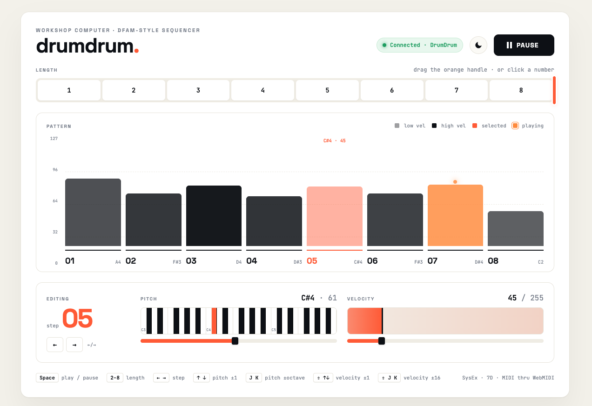
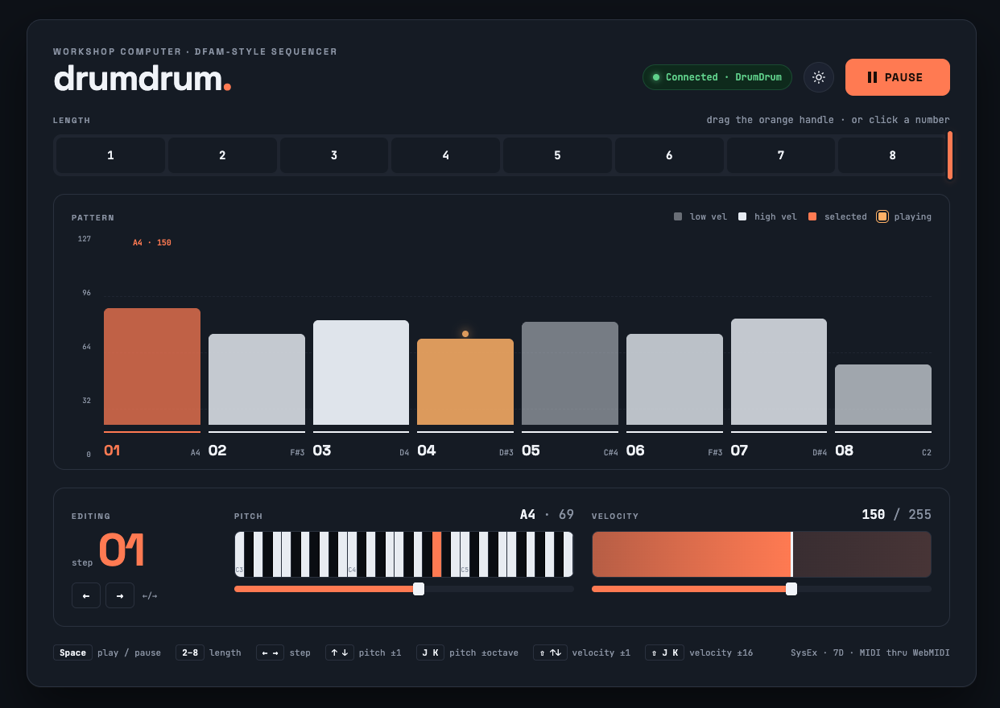

# drumdrum

A DFAM-style 8-step sequencer for the [Music Thing Modular Workshop System Computer](https://www.musicthing.co.uk/Workshop-Computer/).

drumdrum gives you a dual-VCO pitch sequencer with per-step velocity, white noise, step triggers, and end-of-cycle triggers — the core building blocks of a DFAM-style percussion voice, all from a single program card. Sequence data is randomised on every reset, so you can roll the dice on a new pattern any time.

You can drive the sequencer four ways, all sharing the same state:

- **The card itself** — three knobs, the switch, and the six panel LEDs (always available).
- **A Monome Grid** (16×8) plugged into the front USB jack for hands-on visual editing.
- **A [Music Thing 8mu](https://www.musicthing.co.uk/8mu)** plugged into the front USB jack for fader-based control of all 8 steps at once.
- **A browser editor** in Chrome/Edge over WebMIDI when the card is connected to a computer.

The card decides between host mode (Grid / 8mu) and device mode (browser) at boot from the USB-C cable orientation: peripheral plugged in → host mode, computer plugged in → browser mode. Within host mode, Grid vs 8mu is auto-detected from the device's USB class — no configuration needed. Power-cycle to switch between host and device. Panel knobs and switch keep working in all modes.

## Controls

### Switch Positions

| Position | Main Knob | X Knob | Y Knob |
|----------|-----------|--------|--------|
| **Up** (play) | Tempo | Sequence length (1–8 steps) | VCO 2 pitch offset (±24 semitones) |
| **Middle** (edit) | Tempo | Step pitch (0–127 MIDI note) | Step velocity (0–255) |
| **Down** (momentary) | Short press: advance edit cursor. Long press (hold ≥500ms): toggle play/pause | | |

All knobs use pickup/catchup behaviour when switching modes — the knob must pass through the stored value before it takes effect, preventing jumps.

### Play Mode (switch UP)

The sequencer runs, cycling through the active steps. LEDs show the current playback step.

- **Main** controls the internal clock tempo (overridden when an external clock is patched to Pulse In 1).
- **X** sets how many steps are active (1–8). The change takes effect immediately. Length 1 hammers a single step (useful for one-shot voices) — the end-of-cycle trigger fires every tick in that case.
- **Y** transposes VCO 2's pitch relative to VCO 1, in semitones. At noon the two VCOs play in unison; turn CW for higher, CCW for lower. Use this to set intervals (fifths, octaves) or detune for thickness.

### Edit Mode (switch MIDDLE)

Playback continues uninterrupted. The LEDs switch to showing the edit cursor position instead of the playback position.

- **X** sets the pitch for the step at the edit cursor.
- **Y** sets the velocity for that step.
- **Short press down** advances the edit cursor to the next step (wraps at sequence length).
- **Long press down** (hold ≥500ms) toggles play/pause. When paused, advancing the cursor fires a preview trigger on Pulse Out 1 so you can hear each step through your patch.

### LED Encoding

The 6 LEDs (2 columns, 3 rows) encode steps 1–8:

```
Step 1:  *  .     Step 5:  *  *
         .  .              *  *
         .  .              *  .

Step 2:  *  *     Step 6:  *  *
         .  .              *  *
         .  .              *  *

Step 3:  *  *     Step 7:  .  *
         *  .              *  *
         .  .              *  *

Step 4:  *  *     Step 8:  .  .
         *  *              *  *
         .  .              *  *
```

This encoding is used for playback position, edit cursor, and sequence length preview.

## Monome Grid mode

When you plug a Monome Grid (any 16×8 model — modern native-USB or older FTDI-based) into the card's front USB port and power on, the firmware brings up USB host mode and the Grid lights up within about a second. Panel controls keep working in parallel; both interfaces edit the same step data live.

```
            LEFT HALF — sequence overview              RIGHT HALF — selected-step editor
       ┌──────────────────────────────┐           ┌──────────────────────────────┐
row 0  │ length selector (cols 0..7)  │           │ . . . . . . . PLAY/PAUSE     │
row 1  │ ┄ ┄ ┄ ┄ ┄ ┄ ┄ ┄ ┄ ┄ ┄ ┄ ┄ ┄  │           │           ↑ high pitch       │
row 2  │ ┄ ┄ ┄ ┄ ┄ ┄ ┄ ┄ ┄ ┄ ┄ ┄ ┄ ┄  │           │                              │
row 3  │   per-step bars              │           │     pitch picker (40 cells,  │
row 4  │   height = pitch             │           │     every MIDI note          │
row 5  │   brightness = velocity      │           │     reachable)               │
row 6  │ ┄ ┄ ┄ ┄ ┄ ┄ ┄ ┄ ┄ ┄ ┄ ┄ ┄ ┄  │           │           ↓ low pitch        │
row 7  │ ▓▓▓▓▓▓▓▓ steps 1..8 ▓▓▓▓▓▓▓▓ │           │ velocity bar (16 cells)      │
       └──────────────────────────────┘           └──────────────────────────────┘
         cols 0..7                                  cols 8..15
```

### Left half — overview of all 8 steps

- **Row 0** is the **length selector**. Tapping column N sets the sequence length to N+1 steps. Cells 0..length-1 stay lit so you always see the current length.
- **Rows 1–7** are a vertical bar per step, where the **bar height encodes pitch** and the **brightness encodes velocity**. The currently-playing step's bar is full bright; the selected edit step has a brightness floor so it stays visible even at low velocity. Out-of-length steps are dark.
- Tapping any cell in rows 1–7 of a step's column **selects that step for editing** — the right half then shows its pitch and velocity for fine adjustment.

### Right half — editor for the selected step

- **(col 15, row 0): play/pause toggle.** Bright when playing, dim when paused.
- **Rows 1–5: pitch picker.** 40 cells covering all 128 MIDI pitches. Bottom-left = lowest pitch, top-right = highest. Each cell represents 3 or 4 semitones (every MIDI pitch lands somewhere); tap to coarse-pick, then use the panel **X knob in edit mode** for fine tuning between bin centres.
- **Rows 6–7: velocity bar.** 16 cells from bottom-left (low) to top-right (high). Cells fill row 7 first then row 6 as velocity climbs.

Edits made on the Grid persist — the panel knob will not overwrite them unless you actually turn it (the knob has a "must move to take over" guard so a parked knob can't silently clobber Grid changes).

## Music Thing 8mu mode

Plug a [Music Thing 8mu](https://www.musicthing.co.uk/8mu) into the card's front USB-C jack and the eight faders become live edit controls for the eight sequencer steps. Same auto-detection as the Grid — the firmware notices it's a class-compliant USB MIDI device (rather than CDC) and routes accordingly. Panel knobs and switch keep working in parallel.

### Default mapping (factory 8mu)

Out of the box, an unmodified 8mu drives drumdrum without touching the [8mu web editor](https://www.musicthing.co.uk/8mu). Faders send their factory CCs and buttons send their factory notes.

| Control  | Factory message     | Effect                                              |
|----------|---------------------|-----------------------------------------------------|
| Faders 1–8 | CC 34–41          | Step pitches 1–8 (raw 7-bit), or step velocities (`value × 2`) when in velocity-edit mode |
| Button 1 | Note 36 (C2)        | Toggle pitch ↔ velocity edit mode                   |
| Button 2 | Note 48 (C3)        | Toggle play/pause                                   |
| Button 3 | Note 60 (C4)        | Reset to step 1                                     |
| Button 4 | Note 72 (C5)        | Randomize all 8 step pitches + velocities           |

Notes are channel-agnostic; only `note-on` with non-zero velocity acts (a `note-on` with velocity 0 is the running-status note-off and is treated as a release).

### Optional CC alt-bank (configure in the 8mu web editor)

If you'd rather keep one bank for pitches and another for velocities — or you want to drive drumdrum from a non-8mu controller — the firmware also listens to a parallel CC range that you can wire up in the 8mu web editor (or any other MIDI source).

| Alt CC  | Effect                                                              |
|---------|---------------------------------------------------------------------|
| 22      | Toggle pitch ↔ velocity edit mode (same as note 36)                 |
| 23      | Toggle play/pause (same as note 48)                                 |
| 24      | Reset to step 1 (same as note 60)                                   |
| 28      | Edit cursor (0 → step 1, 127 → step 8)                              |
| 50–57   | Step velocities 1–8 (always, regardless of edit mode)               |

CC buttons act on the rising edge (value crossing ≥ 64), so a press registers once even if your button sends a release event afterwards. There is currently no CC equivalent of the randomize action.

### Notes

- The 8mu sends data only when something changes, so step parameters stay at whatever they were until you actually move a fader. Toggling pitch ↔ velocity mode does not reset values; just sweep the fader for the step you want to change.
- Pitch changes are 7-bit (0–127, the full MIDI range, 1:1 with fader position). Velocity changes are 8-bit (0–254, computed as `CC × 2`).
- The 6-axis accelerometer (CC 42–49) is ignored in this firmware. Pitch bend, sysex, and program-change messages are also dropped.
- 8mu and Grid can't be plugged into the front jack at the same time; pick one per session.

## Browser editor (WebMIDI)

When you plug the card into a computer instead of a Grid, it appears as a USB MIDI device named **DrumDrum**. Open `editor.html` in Chrome or Edge — it's a single self-contained file with no build step:

```bash
open editor.html              # macOS
xdg-open editor.html          # Linux
start editor.html             # Windows
```

Or just double-click the file. Chrome treats `file://` as a secure context, so WebMIDI works without a server. The first time, Chrome will ask for "MIDI device access (with system exclusive)" — accept. The status pill in the top-right turns green and the UI populates from the card automatically.





### Layout

- **Header** — `drumdrum.` wordmark on the left, then connection-status pill, dark/light mode toggle, and the big **Play / Pause** button.
- **Length ribbon** — eight numbered cells. Click a number to set the length, or grab the orange handle on the right edge and drag. Cells past the current length are visibly hatched.
- **Pattern bar chart** — one bar per step. **Bar height = pitch** (0–127, axis labels on the left); **bar opacity = velocity** (low velocity is washed out, high velocity is fully saturated). The currently-playing step is the coral bar with a glowing dot above it; the selected step is shown in the orange accent. Click any bar to select that step for editing. Step number and note name sit underneath each bar.
- **Step detail panel** — for the selected step:
  - **Editing** column on the left shows the step number large, with prev/next nav.
  - **Pitch** column has a 3-octave piano strip (click any key to set pitch, centred on the current note) plus a fine 0–127 slider underneath. Current note name and number show on the right.
  - **Velocity** column has a click-and-drag scrub bar with the current value pinned on it, plus a 0–255 slider underneath.
- **Footer** — keyboard-shortcut cheat sheet on the left, protocol info on the right.

### Keyboard shortcuts

| Key | Action |
|---|---|
| `Space` | Play / pause |
| `1`–`8` | Set sequence length |
| `←` / `→` | Select previous / next step |
| `↑` / `↓` | Pitch ± 1 semitone |
| `J` / `K` | Pitch ± octave |
| `Shift+↑` / `Shift+↓` | Velocity ± 1 |
| `Shift+J` / `Shift+K` | Velocity ± 16 |

### How it talks to the card

Edits push to the card immediately; panel-knob changes get pushed back to the browser the same way, so the UI stays in sync no matter where the change came from. The protocol is plain MIDI SysEx with manufacturer ID `0x7D`. Anyone curious can wire up their own client — see `midi_sysex.h` for the full command list.

## Jacks

| Jack | Function |
|------|----------|
| **CV Out 1** | VCO 1 pitch (1V/oct, EEPROM-calibrated, quantised to semitones) |
| **CV Out 2** | Velocity CV (for controlling envelope decay via Slope or similar) |
| **Audio Out 1** | White noise (continuous, always running) |
| **Audio Out 2** | VCO 2 pitch CV (same sequence as VCO 1, offset by Y knob in play mode) |
| **Pulse Out 1** | Step trigger (~2ms pulse each step; preview trigger when paused in edit mode) |
| **Pulse Out 2** | End-of-cycle trigger (fires when the sequence wraps from last step back to first) |
| **Pulse In 1** | External clock input (overrides internal tempo; one step per rising edge) |
| **Pulse In 2** | Reset (returns sequence to step 1 on rising edge) |
| **CV In 1** | Decay CV mod (summed with stored velocity for the current step) |
| **CV In 2** | Global pitch transpose (±24 semitones, affects both CV Out 1 and Audio Out 2) |

## Patch Examples

These patches are written for the Workshop System's analogue section. The Computer's outputs connect to the SineSquare oscillators, Slopes, Ring Mod, Humpback filters, and Mix.

A quick reminder of what's available: two SineSquare VCOs (each with a **pitch input** for V/oct tracking and a separate **FM input** with attenuverter for modulation, plus sine and square outputs), two Slopes (signal input, CV input for rate modulation, output; Loop/off/Blip switch), a Ring Mod (audio input, modulation input, output — works as a VCA when one input receives a unipolar envelope), two Humpback filters (audio in, FM in, CV in for cutoff, Res knob, LP out, BP/HP out — the FM input can also serve as an amplitude control when fed an envelope), and the Mix (four channel inputs with pan on 1–2, L/R outputs, headphone out).

### 1. Classic DFAM Percussion Voice

The essential drum patch: a pitched oscillator shaped by an envelope, with per-step velocity controlling the decay time — just like the real DFAM. Uses the Slope envelope into the VCO's FM input for pitch sweep on the attack, giving each hit a "zap" character.

```
CV Out 1          --> SineSquare 1 pitch input (sequence pitch)
CV Out 2          --> Slope 1 CV input (velocity controls decay time)
Pulse Out 1       --> Slope 1 signal input (step trigger)
Slope 1 output    --> SineSquare 1 FM input (pitch sweep on attack)
SineSquare 1 sine --> Humpback 1 audio input
Slope 1 output    --> Humpback 1 FM input (envelope opens filter as VCA)
Humpback 1 LP out --> Mix channel 1
Audio Out 1       --> Mix channel 2 (noise layer)
```

The sequencer pitch goes to the VCO's dedicated pitch input for tracking. The Slope envelope serves double duty: it sweeps the VCO pitch via the FM input (set the FM attenuverter low for subtle pitch zaps, higher for laser sounds) and opens the Humpback filter as a VCA via the filter's FM input. The velocity CV modulates the Slope's rate — high-velocity steps decay longer (accented), low-velocity steps stay tight. Mix in the white noise for snare-like transients or turn it down for pure pitched drums.

Switch to edit mode (MIDDLE) to program pitches per step with X and velocities with Y. Reset the Computer for a fresh random pattern.

### 2. Dual-VCO Sequence with Cross-Modulation

Both pitch outputs drive the two SineSquare VCOs at an interval set by Y knob. The VCOs cross-modulate each other via their FM inputs for richer timbres, and velocity sweeps the filter cutoff per step.

```
CV Out 1          --> SineSquare 1 pitch input
Audio Out 2       --> SineSquare 2 pitch input
SineSquare 1 sine --> SineSquare 2 FM input (cross-mod: VCO 1 modulates VCO 2)
SineSquare 2 sine --> SineSquare 1 FM input (cross-mod: VCO 2 modulates VCO 1)
SineSquare 1 square --> Humpback 1 audio input
CV Out 2          --> Humpback 1 CV input (velocity controls cutoff)
Pulse Out 1       --> Slope 1 signal input (trigger)
Slope 1 output    --> Humpback 1 FM input (envelope opens filter as VCA)
Humpback 1 LP out --> Mix channel 1
SineSquare 2 square --> Mix channel 2
```

The pitch inputs set the note for each VCO, while the FM inputs are used for cross-modulation between them — the VCOs modulate each other's frequency for complex, evolving timbres. Keep both FM attenuverters low for gentle beating, or turn them up for aggressive clangy sounds. Velocity drives the Humpback cutoff CV, so high-velocity steps sound brighter. The Slope envelope opens the filter via its FM input, acting as a VCA. SineSquare 2's square wave goes raw to the Mix as a second voice.

Set Y knob (play mode) to noon for unison, slightly off for detuned chorus, or to +7 for a fifth.

Note: Audio Out 2 outputs pitch CV (not audio) — it approximates 1V/oct on the audio DAC. Set SineSquare 2's pitch tracking by ear.

### 3. Noise Percussion with Filter VCA

Use the white noise through a filter shaped by a Slope envelope for hi-hat or snare textures. The Humpback's FM input acts as the amplitude control here, leaving the Ring Mod free for other uses.

```
Audio Out 1       --> Humpback 1 audio input (noise source)
CV Out 2          --> Humpback 1 CV input (velocity controls cutoff brightness)
Pulse Out 1       --> Slope 1 signal input (trigger)
Slope 1 output    --> Humpback 1 FM input (envelope opens filter as VCA)
Humpback 1 BP out --> Mix channel 1
```

The Slope envelope opens and closes the Humpback via its FM input — this effectively shapes the noise amplitude per step. The velocity CV on the Humpback's cutoff CV input controls the filter brightness, so high-velocity steps are brighter and more open while low-velocity steps stay dull. Set the filter to bandpass with resonance up for metallic hi-hat tones, or lowpass for snare body. Adjust Slope time for closed hats (short) vs open hats (long).

This patch uses only 4 cables and leaves the Ring Mod, SineSquare VCOs, second Slope, and second Humpback completely free — you could build a full pitched voice alongside using the remaining modules.

### 4. Full Voice: Pitched Sequence + Noise Layer

A more complete patch using both VCOs, both Slopes, and the Ring Mod. The pitched voice uses the Ring Mod as a VCA, and the noise layer uses the filter FM as a second VCA.

```
CV Out 1          --> SineSquare 1 pitch input (VCO 1 pitch)
Audio Out 2       --> SineSquare 2 pitch input (VCO 2 pitch)
Pulse Out 1       --> Slope 1 signal input (trigger for pitched voice)
CV Out 2          --> Slope 1 CV input (velocity controls pitched decay)
SineSquare 1 sine --> Ring Mod audio input
Slope 1 output    --> Ring Mod modulation input (VCA for pitched voice)
Slope 1 output    --> SineSquare 1 FM input (pitch sweep on attack)
Ring Mod output   --> Mix channel 1
SineSquare 2 sine --> Mix channel 2 (drone/interval layer)
Audio Out 1       --> Humpback 1 audio input (noise for percussion)
Pulse Out 1       --> Slope 2 signal input (same trigger for noise)
Slope 2 output    --> Humpback 1 FM input (envelope opens filter as VCA)
Humpback 1 BP out --> Mix channel 3
4 Voltages output --> CV In 2 (live transpose)
```

This combines a pitched percussion voice (VCO 1 through Ring Mod VCA with pitch sweep) with a noise percussion layer (white noise through Humpback filter VCA) and a raw interval drone (VCO 2 direct to mixer). The two Slopes fire on the same step trigger but can have different decay times — set Slope 1 longer for the pitched voice and Slope 2 shorter for tight noise hits. Use 4 Voltages to transpose the whole pattern live. Set the VCO 1 FM attenuverter low for subtle kick-drum pitch zaps. Shorten the sequence to 3–4 steps for tighter grooves.

## Randomisation

Step pitches and velocities are randomised on every reset. If you want a new pattern, just press the reset button on the Workshop Computer. The randomisation covers a 3-octave pitch range (C2–B4) with velocities biased toward the upper half so all steps are audible out of the box.

## Building

Requires the [Raspberry Pi Pico SDK](https://github.com/raspberrypi/pico-sdk).

```bash
mkdir build && cd build
cmake ..
make
```

Flash the resulting `drumdrum.uf2` to the Workshop Computer by holding BOOT while pressing RESET, then dragging the file to the mounted USB drive.

## Technical Details

- **Core 0** runs the sequencer and audio DSP in `ProcessSample()` at 48 kHz in interrupt context. Pure integer arithmetic, no float, no division.
- **Core 1** owns the USB stack — TinyUSB host (Monome Grid via the vendored mext serial protocol, or 8mu via a small in-tree class-compliant USB MIDI host driver since TinyUSB 0.18 doesn't ship one) or device (USB MIDI for the browser editor), decided once at boot from the USB-C CC pins via `USBPowerState()`.
- All four control surfaces (panel, Grid, 8mu, browser editor) share a single `SharedState` struct (`shared_state.h`); cross-core writes are atomic on the M0+, no locks needed. `tickEpoch` is the cross-core "something changed" signal.
- White noise via xorshift32 PRNG, seeded from the hardware timer on each boot.
- CV Out 1 uses EEPROM-calibrated `CVOutMIDINote()` for accurate 1V/oct tracking.
- Audio Out 2 approximates 1V/oct on the 12-bit audio DAC (~28.4 DAC units/semitone, uncalibrated).
- System clock set to 144 MHz to reduce ADC tonal artifacts; all code copied to RAM (`copy_to_ram`) to eliminate flash cache jitter.
- 150 ms boot mute holds audio + pulse outputs at zero so DAC settling and the first trigger don't click.

**Source files:** `main.cpp` (sequencer + audio + role select), `shared_state.h` (cross-core data), `usb_core1.cpp` (USB task pump), `tusb_config.h` + `usb_descriptors.c` (TinyUSB), `monome_mext.c/h` (Grid serial protocol, vendored from MLRws), `grid_ui.cpp/h` (Grid layout + key dispatch), `midi_host.cpp/h` (in-tree class-compliant USB MIDI host driver for 8mu), `midi_sysex.cpp/h` (browser-protocol parser/encoder), `editor.html` (browser editor).

## License

MIT
