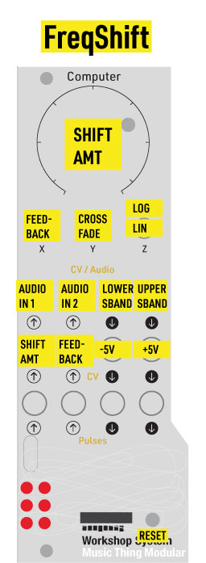

# Frequency Shifter

This frequency shifter is designed for feedback patching and experimental use, similar to the Red Panda 'Radius' pedal. 

## Controls
- **Main** : frequency shift amount (center = 0 Hz)
- **Switch** :
    **Up** : wide, log-scaled bipolar range (+/- 7000 Hz)
    **Middle** : narrower bipolar linear range (+/- 440 Hz)
- **X** : internal feedback amount
- **Y** : crossfade audio inputs

## Inputs
- **AudioIn1** : primary audio input
- **AudioIn2** : secondary audio input
- **CVIn1** : shift modulation (added to Main)
- **CVIn2** : combined feedback path blend (down/up balance)

## Outputs
- **AudioOut1** : low sideband output
- **AudioOut2** : high sideband output
- **CVOut1** : -5V (helpful for CVIn2)
- **CVOut2** : +5V (helpful for CVIn2)

## LEDs
- **0 / 1** : input / output level
- **2 / 3** : positive / negative shift
- **4 / 5** : upper / lower sideband

## Examples

Example track using this card in feedback at: https://benregnier.bandcamp.com/track/freqshift

This is the patch used in the track:  

## Notes
- Includes a RP2040 overclock request to 250 MHz for extra DSP headroom.
