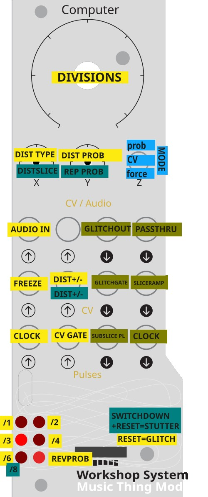

# Glitch — clock-synced beat-repeater for Workshop Computer

A clock-synced beat-repeater with two modes. **Glitch mode** loops and ratchets the last beat with reversal and lo-fi degradation. **Stutter mode** is a live breakbeat slicer that shuffles and repeats slices of the beat in real time. Both modes record into a shared 2.33-second circular buffer and work with the same clock, freeze, and output jacks.

## Installation

1. Connect the Workshop Computer via a data-capable USB cable
2. Power cycle
3. Hold the secret button under the knob on the Workshop Computer, press the reset button, then release the secret button — it mounts as a drive called RPI-RP2
4. Drag and drop `glitch.uf2` onto the drive
5. The Workshop Computer reboots automatically and Glitch is running

## Choosing a mode

Hold the **switch in the desired position while the card powers on** (or resets):

| Switch at reset | Mode |
|---|---|
| Middle or Up (or not held) | **Glitch mode** (default) |
| Down | **Stutter mode** |

A brief boot animation confirms which mode loaded:
- **Glitch mode**: LEDs 0, 2, 4 flash in sequence × 3
- **Stutter mode**: LEDs 5, 3, 1 flash in reverse × 3

---

## Glitch mode

Records incoming audio into a 2.33s circular buffer. On each clock pulse it measures the beat length, then replays a ratcheted sub-slice of that beat — optionally reversed and/or degraded with sample-rate reduction and bitcrushing. When not glitching, live audio passes through unaffected.

### Inputs

| Jack | Function |
|------|----------|
| Audio In 1 | Main audio input |
| Pulse In 1 | Clock — rising edge sets beat length (max 2.33s) |
| Pulse In 2 | External gate (Switch MID mode: glitch while HIGH) |
| CV In 1 | Freeze — above ~0V stops recording, loops frozen buffer content |
| CV In 2 | Bipolar mod — added to both Knob X and Knob Y |

### Outputs

| Jack | Function |
|------|----------|
| Audio Out 1 | Glitched output — live pass-through when not glitching |
| Audio Out 2 | Always dry — live pass-through of Audio In 1 |
| Pulse Out 1 | Sub-slice clock — one pulse at every ratchet slice boundary |
| CV Out 1 | Glitch gate — high (~+5V) while glitching, low (0V) otherwise |
| CV Out 2 | Descending ramp — falls from ~+5V to 0V across each slice, resets at boundary |
| Pulse Out 2 | Clock mirror — Pulse In 1 passed straight through |

### Controls

**Main Knob — Ratchet Zone + Probability**
Five zones selecting ratchet division ÷1 / ÷2 / ÷3 / ÷4 / ÷6. Position within each zone sets the reverse and glitch probability threshold — LED 5 brightness shows the current value. At the low end of each zone, glitches are rare; near the top they are nearly constant.

**Knob X — Degradation Amount**
First half (CCW to centre): sample-rate decimation, up to 16×. Second half (centre to CW): decimation stays at maximum, bitcrushing added progressively up to 7 bits removed. Fully CCW is clean. CV In 2 shifts this value bipolarly.

**Knob Y — Degradation Probability**
How often degradation fires per slice. CCW = never, CW = always. CV In 2 shifts this value bipolarly.

**Switch — Glitch Trigger Mode**

| Position | Mode |
|----------|------|
| UP (latching) | Probabilistic — glitch fires randomly, rate set by Main Knob zone remainder |
| MID | CV gate — glitch fires while Pulse In 2 is HIGH, pass-through when LOW |
| DOWN (momentary) | Force — always glitch every slice |

### LEDs

| LED | Function |
|-----|----------|
| 0–4 | One lit = current ratchet zone (÷1 through ÷6, left column then top-right) |
| 5 | Brightness = reverse/glitch probability threshold |

### Freeze

CV In 1 above ~0V freezes the buffer — recording stops and the current buffer contents are held. The clock and playback engine keep running, so the card continues glitching and ratcheting the frozen material. Adjust the Main Knob, switch, or Knob X/Y while frozen to re-process the same snapshot. Remove the CV to resume recording.

### Quick start

1. Patch a clock into Pulse In 1 and audio into Audio In 1
2. Set Switch DOWN — the last beat repeats immediately
3. Turn Main Knob clockwise through zones to hear higher subdivisions
4. Move Switch UP and use the zone remainder to control how often glitches fire
5. Bring up Knob X for degradation, Knob Y to control how often it applies
6. Patch a gate into CV In 1 to freeze a moment and keep re-glitching it

### Use cases

**Classic beat-repeat** — Patch a clock from a sequencer or drum machine. Route the drum machine audio into Audio In 1. Set Switch DOWN. The last beat loops immediately. Turn the Main Knob to ÷2 or ÷4 for ratcheted subdivisions.

**Probability glitching** — Switch UP, Main Knob in the upper part of any zone. Glitches fire occasionally, creating an irregular loop effect without being constant. The zone remainder sets how dense the glitching becomes — subtle at the low end of a zone, heavy near the top.

**Freeze and re-degrade** — Send a gate or manual CV to CV In 1 to lock a moment in the buffer. Then sweep Knob X from clean to fully crushed, and Knob Y to control whether degradation fires every slice. The same frozen phrase cycles with increasing grit.

**CV-gated drops** — Patch an envelope, LFO gate, or sequencer gate to Pulse In 2 and set Switch MID. Glitching only happens while the gate is high — use it to trigger drop effects or fill patterns at specific points in a sequence.

**Ramp-faded repeats** — Patch CV Out 2 to a VCA placed after Audio Out 1. The descending ramp naturally fades each repeated slice from loud to quiet, giving each glitch a decaying character.

---

## Stutter mode

A live breakbeat slicer. The card records audio into the same 2.33s buffer, divides each beat into equal slices, shuffles their playback order, and optionally repeats slices before advancing. When not shuffling, live audio passes through — so the output is a mix of re-sequenced buffer grabs and real-time audio.

### Inputs

| Jack | Function |
|------|----------|
| Audio In 1 | Main audio input |
| Pulse In 1 | Clock — one pulse per beat (max 2.33s) |
| Pulse In 2 | CV gate (Switch MID mode: HIGH = shuffle this slice, LOW = pass-through) |
| CV In 1 | Freeze — above ~0V stops recording, engine keeps stuttering frozen content |
| CV In 2 | Bipolar mod — added to Knob X (shuffle probability) only |

### Outputs

| Jack | Function |
|------|----------|
| Audio Out 1 | Shuffled output — live pass-through when not shuffling this slice |
| Audio Out 2 | Always dry — live pass-through of Audio In 1 |
| Pulse Out 1 | Slice clock — one pulse at every slice boundary |
| CV Out 1 | Shuffle gate — high (+5V) while reading a shuffled slice, low (0V) during pass-through |
| CV Out 2 | Descending ramp — falls from ~+5V to 0V across each slice, resets at boundary |
| Pulse Out 2 | Clock mirror — Pulse In 1 passed straight through |

### Controls

**Main Knob — Slice Count + Drift**
Five zones selecting slice count 1 / 2 / 3 / 4 / 8 per beat. Position within each zone sets **drift probability** (shown on LED 5): how often the beat pool is drawn from an earlier beat rather than the most recent one. At LED 5 dark (zero), slices always come from the current beat, locked to the clock grid. As LED 5 brightens, the engine increasingly reaches back one, two, or three whole beats — the slice grid stays internally coherent (slices are always a fixed fraction of a real past beat) but the material drifts across bars.

**Knob X — Shuffle Probability**
In Switch UP mode: how often each slice is shuffled rather than passed through live. CCW = all pass-through (clean, no effect). CW = always shuffled. CV In 2 shifts this bipolarly.

**Knob Y — Repeat Probability**
How often a slice replays before advancing to the next. CCW = always advances, CW = heavy stutter. Works on both shuffled and pass-through slices.

**Switch — Shuffle Trigger Mode**

| Position | Mode |
|----------|------|
| UP (latching) | Probabilistic — each slice shuffled randomly based on Knob X threshold |
| MID | CV gate — Pulse In 2 HIGH shuffles this slice, LOW passes through live |
| DOWN (momentary) | Force — always shuffle every slice, never pass-through |

### LEDs

| LED | Function |
|-----|----------|
| 0–4 | One lit = current slice count zone (1 / 2 / 3 / 4 / 8) |
| 5 | Brightness = drift probability (how far back beats can reach) |

### Freeze

CV In 1 above ~0V freezes the buffer. Recording stops, but the shuffle engine keeps running against the frozen content — slices are drawn from the locked snapshot. Freeze a phrase then sweep Knob X and Y to chop and stutter it indefinitely. Drift (LED 5) still works within the frozen buffer's content.

### Quick start

1. Patch a clock (one pulse per beat) into Pulse In 1 and rhythmic audio into Audio In 1
2. Let the buffer fill for two or three beats
3. Set Switch DOWN — every slice is shuffled, the beat is immediately scrambled
4. Turn Main Knob to zone 4 (8 slices) for 16th-note chops
5. Move Switch UP and dial Knob X back to control how often chops fire
6. Bring Knob Y up to add stutter repeats within slices
7. Open LED 5 (Main Knob zone remainder) to allow material from earlier beats

### Use cases

**Breakbeat chop** — Drum loop or break into Audio In 1, clock synced to tempo. Switch DOWN, Main Knob zone 4 (8 slices). Every slice of the beat is scrambled — classic cut-up break effect. Adjust the Main Knob within zone 4 to allow occasional drift from earlier bars.

**Controlled variation** — Switch UP, Knob X at about 9 o'clock. Most slices pass through clean, but a random chop drops in roughly one in four beats. The music stays mostly intact with occasional surprise rearrangements.

**CV-triggered scrambles** — Patch a gate from a sequencer step into Pulse In 2, set Switch MID. The beat plays through cleanly except on the gated step, where slices are shuffled. Use it to fire a scramble on the fourth beat of every bar, or on a specific note of a melody.

**Stutter build** — Switch DOWN, Knob Y at 3 o'clock. Each slice replays roughly twice before advancing, creating a rhythmic stutter that doubles the apparent tempo feel. Sweep Knob Y higher to increase tension.

**Time-slip loop** — Let the buffer fill for 4–8 beats. Open LED 5 to half brightness. The engine starts pulling slices from beats 1–3 bars back as well as the current beat. Freeze with CV In 1 to lock a moment in time, then the card creates an evolving collage from multiple past phrases without any new audio coming in.

**Freeze and chop** — Gate CV In 1 high to capture a phrase (spoken word, a chord stab, a percussion hit). The buffer locks. Sweep Knob X and Y to chop and repeat the frozen content at any slice count — turn a single hit into a machine-gun stutter or a melodic fragment into a beat.

---

Full source: https://github.com/uglifruit/Workshop_Computer/tree/main/Demonstrations%2BHelloWorlds/PicoSDK/ComputerCard/examples/glitch
