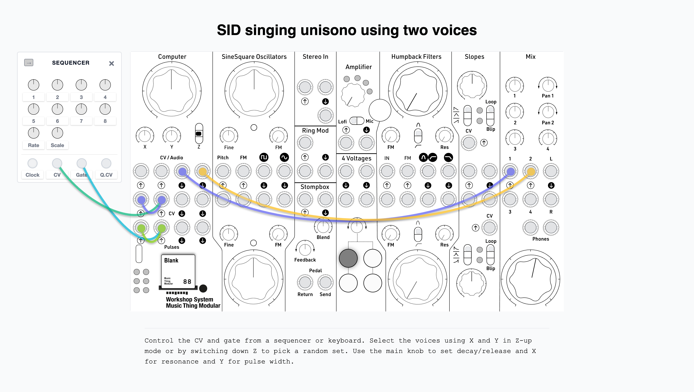

# Voices of SID

Authentic MOS 6581 SID chip emulation using the reSID engine, configured as a dual-SID stereo synthesizer with 1V/oct CV/gate control, waveform selection, and randomize.

## What It Does

Two emulated SID chips (MOS 6581, PAL clock at 985248 Hz) run in parallel, each on its own audio output:

- **Audio Out 1** (left): SID chip 1 — voices 1 (lead) + 3 (ring-mod/sync carrier)
- **Audio Out 2** (right): SID chip 2 — voice 2 (second voice)

This gives you two independent monophonic synth voices with the classic C64 sound: triangle, saw, pulse, noise, and combined waveforms, plus the SID's legendary analog-modelled filter with resonance.

CV and pulse inputs are passed through to the outputs, so you can chain multiple modules by patching through this card.

## Controls

### Switch Z

| Position | Mode | Description |
|----------|------|-------------|
| **Middle** | Play | CV/gate control. Main = decay/release, X = resonance, Y = pulse width |
| **Up** | Sound Edit | X/Y select waveforms (8 options each). Gates always open (drone/tuning mode) |
| **Down (hold)** | Randomize | Continuously cycles attack, sustain, waveforms, ring mod, and sync. Spinning LED animation. Release to keep the new sound |

### Knobs (Play mode)

| Knob | Function |
|------|----------|
| **Main** | Decay/release time (0–15, shared by both voices) |
| **X** | Filter resonance (0–15) |
| **Y** | Pulse width (shared by both voices, minimum 40) |

### Knobs (Sound Edit mode)

| Knob | Function |
|------|----------|
| **Main** | Decay/release time (same as Play mode) |
| **X** | Voice 1 waveform (8 stops — see waveform table below) |
| **Y** | Voice 2 waveform (8 stops) |

Waveform selections carry over to Play mode when you switch back.

### CV Inputs

| Input | Function |
|--------|----------|
| **CV 1** | 1V/octave pitch for SID1 voice 0 (lead) and SID1 voice 2 carrier (ring/sync) |
| **CV 2** | 1V/octave pitch for SID2 voice 1 (second voice) |

### Pulse Inputs

| Input | Function |
|--------|----------|
| **Pulse 1** | Gate for voice 1 (high = gate open, low = release) |
| **Pulse 2** | Gate for voice 2 |

### Outputs (pass-through)

| Output | Function |
|--------|----------|
| **CV Out 1** | 1:1 copy of CV In 1 — for chaining modules |
| **CV Out 2** | 1:1 copy of CV In 2 |
| **Pulse Out 1** | 1:1 copy of Pulse In 1 — gate passthrough |
| **Pulse Out 2** | 1:1 copy of Pulse In 2 |

### Waveform Table

| Position | Waveform |
|----------|----------|
| 0 | Pulse |
| 1 | Triangle |
| 2 | Saw |
| 3 | Pulse + Saw |
| 4 | Triangle + Saw |
| 5 | Triangle + Pulse |
| 6 | Triangle + Ring Mod |
| 7 | Noise |

### LEDs

| LED | Sound Edit mode | Play mode |
|-----|-----------------|-----------|
| 0 | Voice 1 waveform bit 0 | Gate 1 active |
| 1 | Voice 1 waveform bit 1 | Gate 2 active |
| 2 | Voice 1 waveform bit 2 | Off |
| 3 | Voice 2 waveform bit 0 | Voice 1 waveform bit 0 |
| 4 | Voice 2 waveform bit 1 | Voice 1 waveform bit 1 |
| 5 | Voice 2 waveform bit 2 | Voice 1 waveform bit 2 |

In Sound Edit mode, LEDs 0–2 show voice 1's waveform index in binary, LEDs 3–5 show voice 2's.
In Play mode, LEDs 0–1 show gate status, LEDs 3–5 show voice 1's waveform index.

## Randomize (Z Down)

Hold Z down to continuously randomize:

- Attack (0–4, snappy)
- Sustain (4–15, always audible)
- Waveforms for both voices (all 8 options)
- Ring modulation (25% chance)
- Hard sync (10% chance)

Decay/release remains controlled by the Main knob. Release Z to keep the current sound.

## Architecture

- **reSID** — Dag Lem's cycle-accurate MOS 6581 SID emulation engine (GPL v2)
- **Dual SID** — two independent SID chips, each with its own filter
- **Voice routing** — sid1 carries voices 1 + 3 (ring-mod carrier / sync source); sid2 carries voice 2. Unused voices are muted per chip.
- **Filter** — low-pass, cutoff fully open by default. Resonance controlled by X knob in Play mode. Filter routes voices 0+1 through the filter, voice 2 bypasses it (per SID chip).
- **Clock** — 200 MHz RP2040, SID engine runs at PAL C64 clock (985248 Hz), downsampled to 48 kHz

## Example Patch



## Build Instructions

Requires Pico SDK (`PICO_SDK_PATH` must be set). Build from the card directory:

```sh
cmake -S . -B build
cmake --build build -j$(sysctl -n hw.logicalcpu)
```

Output: `build/voices_of_sid.uf2`

Hold BOOTSEL on the Pico, plug USB, and copy the `.uf2` file to the mounted drive.

## Credits

- The reSID engine in the `reSID/` directory is Copyright (C) 2004 Dag Lem and released under the GNU General Public License v2. See `reSID/COPYING` for details.
- Built with the Workshop Computer ComputerCard library by Chris Johnson
- Built by Joep Vermaat using opencode, using GLM 5.1, Deepseek 4 Pro, Open AI Codex

## License

This project is released under the [MIT License](LICENSE). Use it, modify it, fork it, break it, improve it. No warranties, no liabilities. If you build something from this, you don't owe me anything — but I'd love to hear about it.
