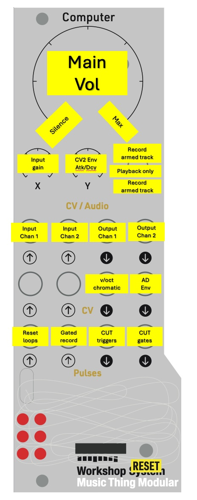
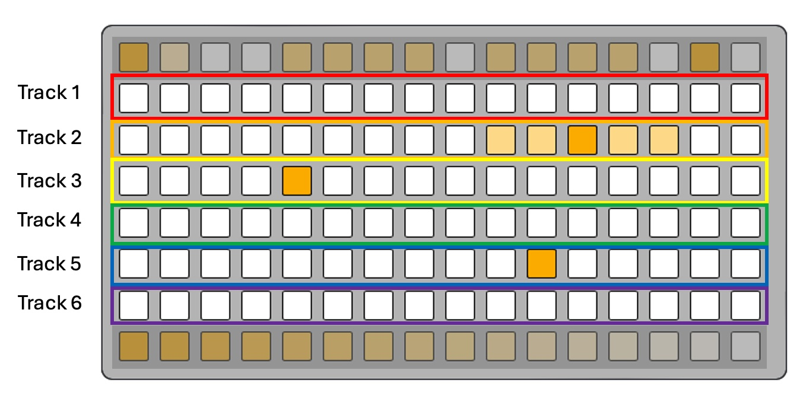
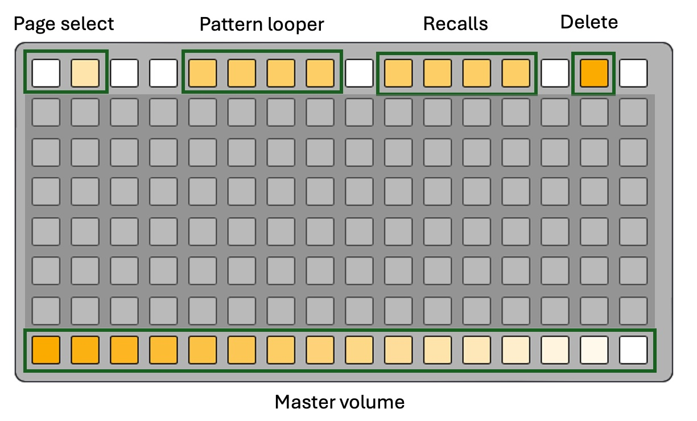
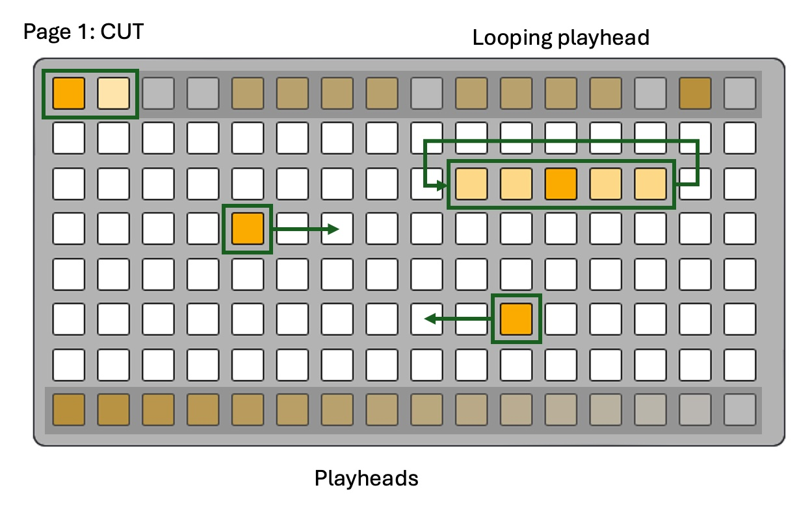
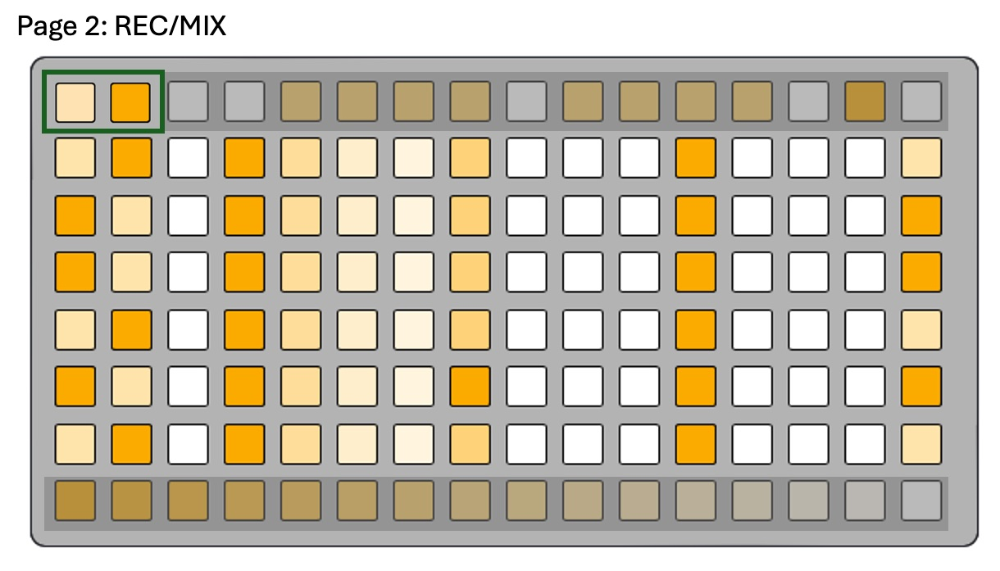
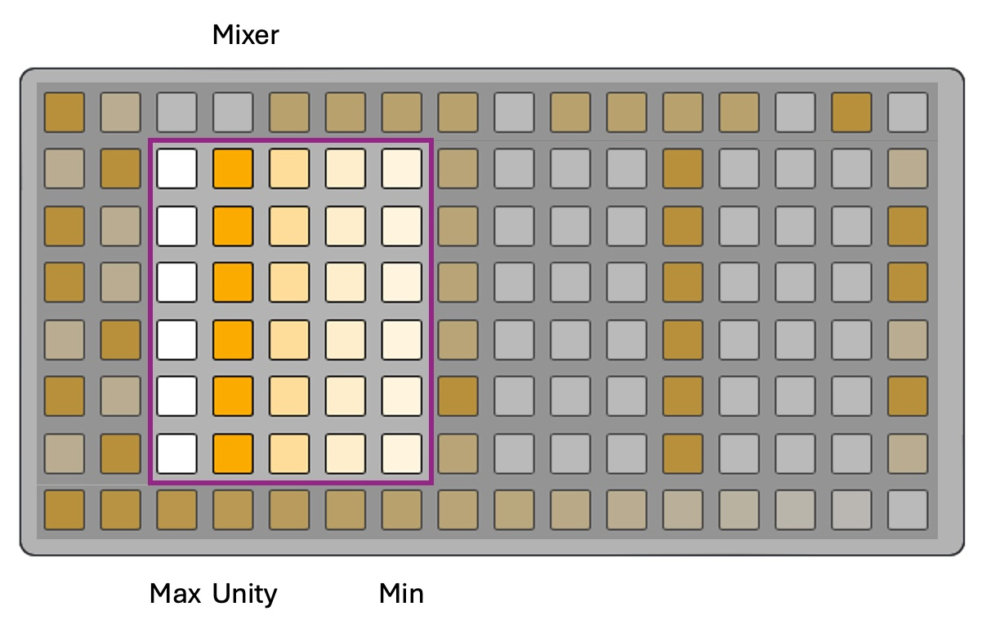
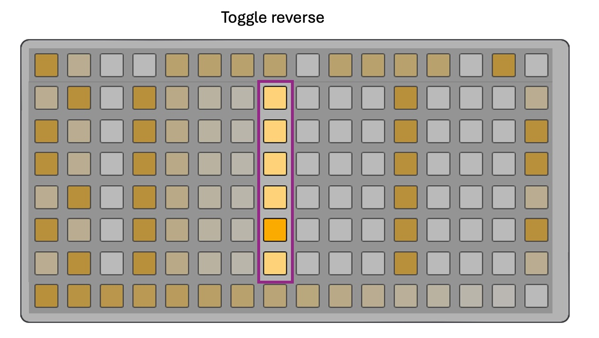
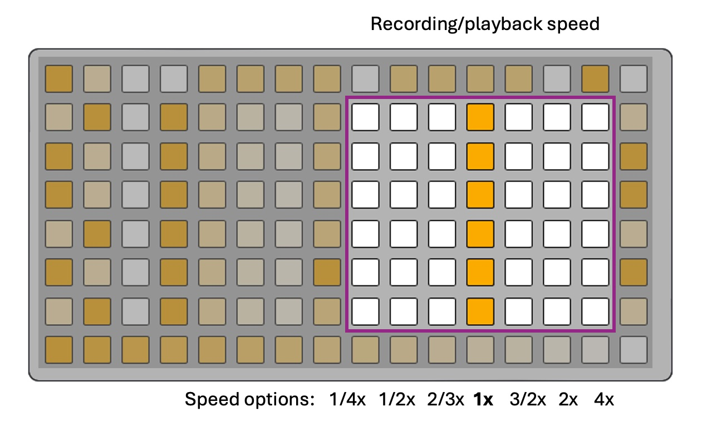

# Grid mode

This is the main MLRws performance interface — six tracks of looping audio, all driven from a monome or DIY grid / midigrid.

This doc applies to **both** grid-bearing modes:

- **Host mode** — grid plugged directly into the Computer's USB-C port
  (power-on with the grid attached).
- **Device mode** — Computer is the USB device; a host (e.g. norns running the
  [`gridproxy`](https://github.com/dessertplanet/gridproxy) mod) forwards grid
  traffic the Computer over CDC.

The behaviour and layout are identical in both modes.

## Hardware in / out (on the Computer)

In grid mode, the interface on the Computer itself is very simple. Tracks are recorded as mono ADPCM and can be routed independently to Audio Out 1 or Audio Out 2. X knob is the input gain. Main knob is the main output volume.

CV in/out are not used in grid mode. Pulse in jacks are used for transport-style triggers (see [Pulse inputs](#pulse-inputs) below). Pulse outputs are unused.

## Pulse inputs

Both pulse-in jacks act as transport-style triggers in grid mode:

- **Pulse In 1** — *loop reset*. A rising edge resets the playhead of every track that is currently playing **and** has an active CUT-page loop, jumping each one to the loop's start column. The loop remains active; only the playhead jumps. Tracks without an active loop, and stopped tracks, are unaffected. (Matches gridless mode, where Pulse In 1 is also the reset trigger.)
- **Pulse In 2** — *gated record*. While a track is armed via the REC page, holding Pulse In 2 high records into that track for as long as the gate is high. Recording starts on the rising edge and stops on the falling edge. The usual record gates still apply (a track must be armed, recording must not already be in progress, and the per-recording sample limit must not have been reached). While pulse-gated recording is active, the front-panel switch will not interrupt it.

Pulse Out 1 and Pulse Out 2 are unused in grid mode and remain low.

## Track layout

Central to the grid layout on both pages is that the center of the grid is organized into horizontal tracks, with rows 2-7 representing tracks 1-6.

## The edge keys

The keys at each of the four grid edges have common functionality no matter which page you are on in MLRws.

### Page selection

The two grid keys at the top left of the grid control which page is selected between page 1: [CUT](#cut-page--playhead-cutting--loop-a-section) and page 2: [REC](#rec-page--mixer-reverse-and-speed).

### Pattern looper

Patterns are **timed motion recorders**. They capture every grid-based event you
generate (cuts, loops, speed changes, reverse toggles, volume changes,
master moves, even other patterns/recalls firing) and play them back in a
free-running loop.

You interact with patterns using the group of 4 dim LEDs to the right of page selection in the top row. A dim pattern slot indicates an empty one. press an empty pattern slot to arm the looper. Your next grid gesture starts the recording and recording continues until you press the recording pattern button again, at which point loop playback starts immediately.

Once recorded, pattern playback can be toggled on/off in the patter looper area of the grid. To record a fresh pattern over an existing one, first clear the old one by holding the DELETE key and then touching the pattern you want to overwrite, which will clear it.

Multiple patterns can play simultaneously. Each pattern's loop length is
determined by the time between record-start and record-stop, so you can
layer different-length loops.

### Scenes

Scenes are **instant snapshots** of every track's state (current cut
position, loop region, speed, reverse, volume, gate flags). They have no
timing — pressing a recall instantly places all tracks into the snapshot
state.

Scenes are controlled by using the second group of 4 dim LEDs to the right of the pattern looper in the top row. Touch an empty scene slot to capture the current configuration as a scene. Recall a captured scene from any other grid state by touching the corresponding scene key. Note that when you are in a grid state that does not correspond to any recorded scene and you switch to a scene with the scene keys, pressing the same scene key will switch you back to your previous state without having to capture that state- so you can easily have momentary switches to scenes without losing progress.

Scenes are themselves recorded into patterns, so you can build a pattern
that triggers different scenes at different times.

Overwriting a scene requires that you clear the old one by holding the delete key then pressing the scene key that you want to clear.

### Delete

The delete key is used to clear data from various places in MLRws. Hold it down and then press a pattern or scene to clear it. Hold it down and press the record-arm button for any track with audio on it and that audio will be cleared.

Hold the delete key by itself for 5 seconds to reset the current saved scene parameters to defaults. The delete key flashes three times quickly to confirm. This resets current speed, reverse, loop, mixer level, gate mode, track groups, and active recall state, then saves those defaults to flash. Currently playing patterns are stopped so they do not immediately re-apply old automation. It does **not** reset master volume, or delete audio, patterns, or saved recall slots.

### Playback toggle and gated playback

The right side of the grid always controls the playback state of each track. Short press any key in the right-most column on the grid and the corresponding track playback is toggled on/off. Long press one of these and the playback key will flash, indicating "gated playback" mode. In this mode, playback will only occur while a key in the CUT page is held down. Very useful for percussive sounds and very fun to record with the pattern looper. 

Gate mode is per-track, so you can have some rows in gate mode and others
in normal playback mode. Gate-mode state is saved alongside the scene, so each track returns to its last gated/normal setting after a power cycle.

### Track groups

Multiple tracks can be linked into a **group** so that play/pause and reset commands apply to every member at once. CUT-page behavior depends on how the grouped tracks were started: groups started from the REC-page play keys stay phase-linked, while groups started from CUT keep the one-row choke behavior.

- **Create a group**: hold two or more populated play keys (right-most column) at the same time. Tracks without recorded audio are ignored for grouping. As soon as a second populated play key joins, MLRws cancels the pending gated-playback long-press timer on every held key, so none of them will accidentally enter gated playback. When you start releasing the keys, the **first release** commits the group — every populated play key that was simultaneously held at that moment becomes a group, and their play LEDs flash rapidly to confirm. (The remaining held keys' releases are absorbed silently.) Hold just one play key by itself and the original long-press → gated-playback behaviour is unchanged.
- **Dissolve a group**: hold the **DELETE** key (row 0 ALT). While DELETE is held, MLRws cycles through every existing group, fast-blinking each group's play keys in turn. Each group flashes twice before moving to the next one so you can see which tracks belong to which group. Touch any key on any member row to dissolve that group; the former members' play LEDs blink twice quickly to confirm. Solo tracks keep their normal DELETE-modified actions, including clearing audio with DELETE + the record-arm column.
- **Group sync**: play/pause toggles and the Pulse In 1 reset broadcast to every member. Play/pause is **state-synced**: whichever member you tap, every member snaps to the opposite of *that* member's current play state — so a group can never drift out of phase after a single tap. If the group was started from the REC page play keys, CUT taps, loop-a-section gestures, speed, reverse, and mixer changes broadcast too, with every member acting on the same grid column numbers and mapping them proportionally to its own length where applicable. If the group was started from CUT, CUT taps and loops keep the existing choke behavior, and REC-page parameter edits affect only the touched row.
- **Joining a new group**: a track joining a new group leaves any previous group it belonged to. The remaining members of the previous group stay grouped together.
- **Recording over a member**: starting a recording on a member of a group automatically removes that track from the group. The remaining members stay grouped.
- **Persistence**: groups survive a power cycle and are saved to the scene blob when created or dissolved.
- Solo tracks behave exactly as before.

### Grid-based main volume control

The bottom row on the grid is used to represent the main volume (also controlled by the Main knob on the Computer). Volume control is "last-write-wins" so updating main volume via grid will take precedence over the main knob control until the main knob's next change.

### Arm for recording

The left-most column on the grid is used to arm tracks for recording. For details see [Recording](#recording)

## CUT page — playhead cutting & loop-a-section

The CUT page is the performance heart of MLR. Each row is a 14-step scrub bar
across the track's audio.

- **Tap column 2–15**: jump the playhead to that position and (re-)start the
  track. The bright cell tracks the playhead in real time.
- **Hold 2+ keys on a row**: define a loop region between the lowest and
  highest held keys. The loop region stays dimly lit while looping. Releasing
  all keys leaves the loop in place.
- **Tap a single key inside or outside an active loop**: clears the loop and
  cuts to that position.
- **Delete + any key on cols 2–15**: stop the track without changing position.

Recording from the CUT page is the same as on the REC page: see
[Recording](#recording).

## REC page — input channel, mixer, reverse, and speed

The REC page (page 2) is the per-track parameter editor. We will break this page into parts for simplicity below.

### Record arm and input channel

On all grids, col 0 arms a track for recording. On 16-wide grids, cols 0 and 1 also choose which input/output bus the track uses: col 0 = Audio In/Out 1, col 1 = Audio In/Out 2. The selected channel is shown on recorded tracks, and while a track is armed or actively recording the selected channel LED carries the record-arm flash. Changing the channel of an existing recorded track rewrites the track header so the output assignment survives power cycling.

If you have not manually picked a channel for a track, MLRws will auto-select the plugged input when exactly one of Audio In 1 or Audio In 2 is connected. With both or neither connected, it keeps the track's previous channel.

### Mixer

Five discrete level slots. The left side is the loudest (about +3 dB), the right side is the
quietest (about −15 dB), the second column from the left (the default, shown below) is unity gain.

While a track is **actively recording**, the mixer area turns into a record-progress
bar instead of a mixer, indicating how much recording time remains at the current recording speed.

### Reverse

Tap to flip playback direction. LED is bright when reverse is on.

### Speed

Seven discrete pitch slots, symmetric around 1× speed. From the left, with the corresponding music interval you will hear based on a track recorded at 1x speed, the options are:

- 1/4x speed (-2 oct)
- 1/2x speed (−1 oct)
- 2/3x speed (−5th)
- 1×
- 3/2x speed (+5th)
- 2x speed (+1 oct)
- 4x speed (+2 oct)

Note that these intervals change depending on what speed you originally recorded the track.

## Recording

Recording is **speed-linked** — whatever rate the track is set to on the REC
page becomes the record rate too, so half-speed recording captures twice as
many seconds of maximum audio length and trades quality for more time. The slower the recording speed the more noise and distortion will be introduced.

It is possible to record at faster than 1x but you will encounter potentially interesting weirdness- only recommended if you like strange digital noise. The resampling trips over itself and encodes who-knows-what.

While a track is armed or recording, **Knob X** controls how loud the input
is recorded. The same level is applied to the monitor mix so what you hear
matches what you'll capture. Note the track level from the grid mixer is also applied both to the monitor and the recording.

When the maximum recording length is reached the track auto-stops.

The card writes the new audio to flash after the switch
returns to middle- and recordings are therefore persisted on the card itself. 

There are two ways to record:

### Armed recording

1. While the switch is at **Middle**, tap col 0 on the desired track row.
   The arm LED starts a slow flash. Any track that was playing on that row
   stops so you do not record over itself, and input monitoring is enabled.
2. Move the switch **Up or Down**. Recording starts immediately, the arm LED
   goes to a fast blink, and the mixer area (REC page) or cols 1–14 (CUT page) become a
   progress bar.
3. Return the switch to Middle to stop. The track is automatically disarmed and playback starts immediately. Other tracks that were already playing keep playing while you record.

### Gated recording

If no track is armed and the switch is already Up or Down, **press and hold**
col 0 on a track row — recording runs for as long as you hold the key (or
until the switch returns to middle, or the track fills up). This is the
fastest way to grab a quick stab.
