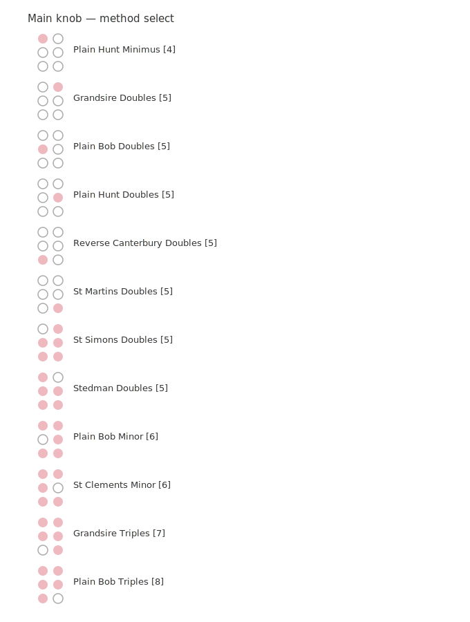
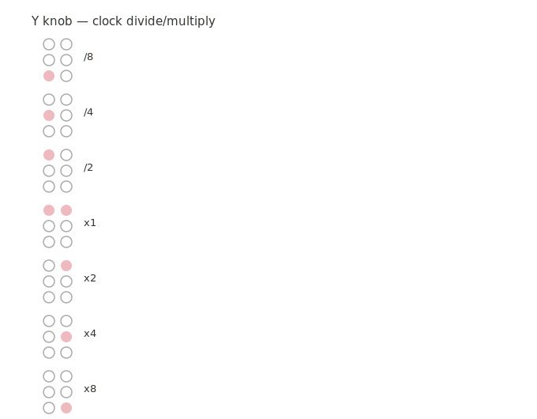
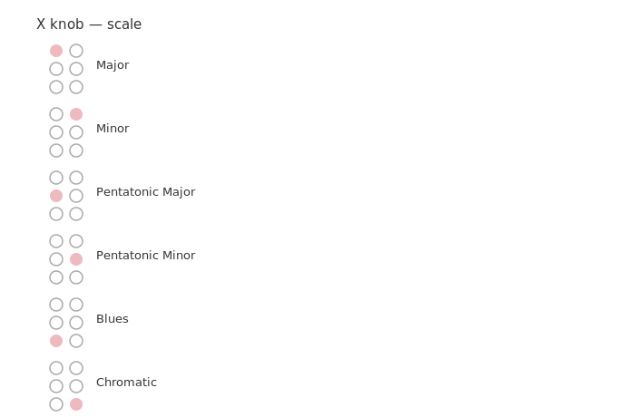

**The Bells / Program Card V1**

A bellringing methods sequencer by James Saunders

**What is The Bells card?** 

The Bells is a sequencer that provides 12 bell ringing methods with tempo and jitter controls, quantised to six different scales.

It sends a v/oct pitch sequence and synchronised pulse to control the oscillators or other inputs that could respond to permutation patterns.

Its parameters are controllable during playback and in a setup mode, accessible by holding Z down while turning a knob. Z switches between play, stop and edit modes. 

**About**

This is a port from a prototype Eurorack module I’ve been working on over the last year. It has some additional functionality (8 gates to cue a sampler, more methods, pitch selection), but otherwise the Workshop System version is very similar. I originally made the module as my first attempt at hardware development, having been ringing bells for the past two years, and also having an obsession with permutation patterns. 

I would love to hear what anybody does with this, so please send me anything you make. Also, new feature suggestions are always welcome, as are any information about errors. 

More information on bell ringing: [change ringing](https://en.wikipedia.org/wiki/Change_ringing) / [methods diagrams](https://fortran.orpheusweb.co.uk/Bells/Diagrams/IndPDF.htm)

For questions or support, email [jamessaundersalloneword@gmail.com](mailto:jamessaundersalloneword@gmail.com) or visit [www.james-saunders.com](http://www.james-saunders.com)

**CONTROLS**

| Z | UP: play MIDDLE: stop DOWN (hold): edit  |  |  |  |
| :---- | :---- | :---- | :---- | ----- |
|  | PLAY/STOP MODES |  | EDIT MODE   |  |
| MAIN | Changes raw tempo from 5-300 BPM |  | Select method  |  |
| X | Sets jitter between 0-40% of  |  | Select clock divide amount from /8 to x8  |  |
| Y | Turns covering tenor off (CCW-12) or on (12-CW) |  | Select scale |  |
|   **LEDs**  |  |  |  |  |

