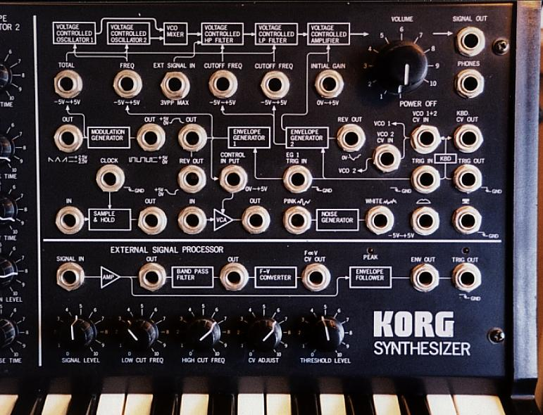

# ESP
A MS-20-style External Signal Processor that includes a preamp, bandpass filter, envelope follower, gate, and 1v/oct pitch outs. 
  
UF2 build at [/UF2](./UF2)  
PDF Documentation at [docs/ESP_Card_Doc](./docs/ESP_Card_Doc.pdf)  
