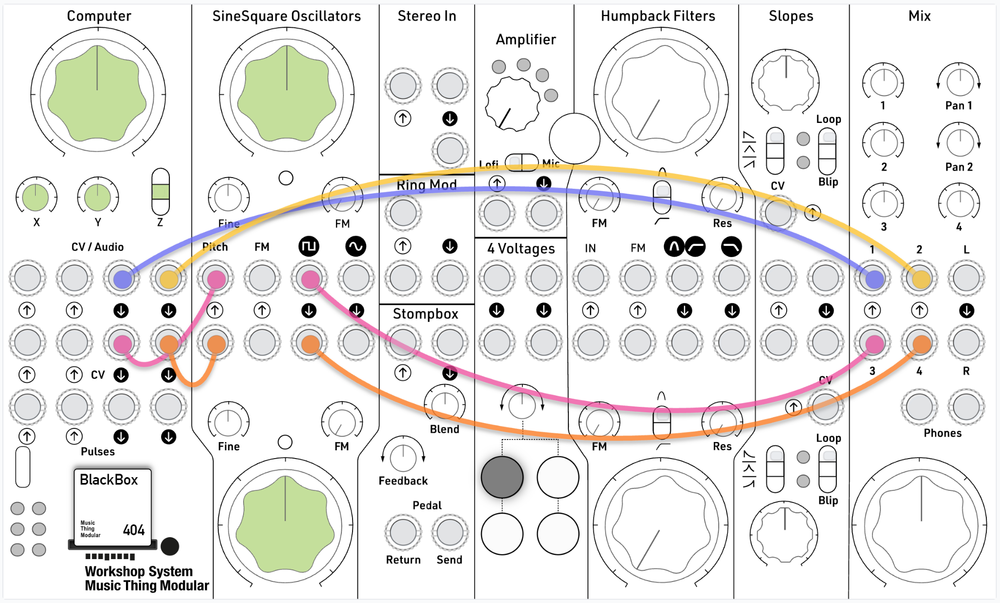

# BlackBox

> *It is not necessary to enter the black box to understand the nature of the function it performs.* (Stafford Beer)

A sealed system of audio, voltages and pulses, freshly generated by each press of **Z**. Vary its inputs and observe its outputs to learn what it does.

Whatever the system, some things never change:

- Audio jacks are always sound.
- CV jacks are always voltages.
- Pulse jacks are always rhythms or events.
- Every knob always does something.
- Every patch plays on its own, so you don't need to plug anything into the inputs.

## How to use it

1. Set up the starter patch below.
2. Leave the inputs empty and set the knobs to 12 o'clock.
3. **Tap Z.** After about half a second a new patch fades in.
4. Listen, watch the LEDs, and turn one knob at a time.
5. Like it? **Hold Z** for about half a second to change it a little. Tap Z again to throw it away and get a new one.

Nothing is saved. Every patch is a one-off.

## Starter patch

Use the patch below to get an approximate sense of what the current generation is doing.

Leave all six inputs empty to begin with. Set both oscillators' pitch knobs mid-range, because the CV can swing a long way up or down.

To test the pulse outputs, unplug the oscillators from mixer channels 3 and 4, and patch the pulse outputs in instead. The pulses come through as clicks, so you can hear the two rhythms against each other. Start with those faders low, because pulses are much louder than audio. You can also just watch the bottom row of LEDs, which flash on each pulse.

## Observing a system

- **LEDs:** top row is audio level, middle row is CV voltage, bottom row flashes on pulses.
- **Audio outs:** is it a drone or a rhythm? Does it follow one of the pulse LEDs?
- **CV outs (on the oscillators):** a melody means a sequence. A siren or vibrato means an LFO. Wandering means random or chaos. A swoop up and back down on each hit means an envelope.
- **Knobs:** turn one at a time from 12 o'clock, both ways. Each one changes two of the outputs, and sometimes the tempo.
- **Inputs:** try patching the card into itself first, such as Pulse Out 1 into Pulse In 1 or CV Out 1 into CV In 1. You already know what that signal is, so it's easier to hear what the input does.

## What might be on each jack

**Audio Out 1 and 2**: synth voice, FM, plucked string, noise, bytebeat, wavefolder, grains, tape delay or ring mod.

**CV Out 1 and 2**: sequencer, Turing machine, LFO, smooth random, chaos, envelope or envelope follower. Melodies are 1V/oct.

**Pulse Out 1 and 2**: clock divider, Euclidean rhythm, random gate, bursts, comparator or irregular groups (such as 3+3+2).

**Main, X and Y (Variables 1–3)**: each moves internal settings on two outputs (pitch, filter, speed, density, pattern and so on), sometimes plus tempo. Between them they reach all six outputs.

**Audio In 1 and 2**: processed by an effect, excite a plucked string, ring-mod or gate a voice, or move a setting by loudness.

**CV In 1 and 2**: bend one or two internal settings, like a knob you control with voltage.

**Pulse In 1 and 2**: clock, reset, trigger, reroll (shake something up) or sample-and-hold. On a grain or delay voice, trigger freezes the sound.

**Z switch**: tap for a new patch, hold to mutate. Up is unused.
