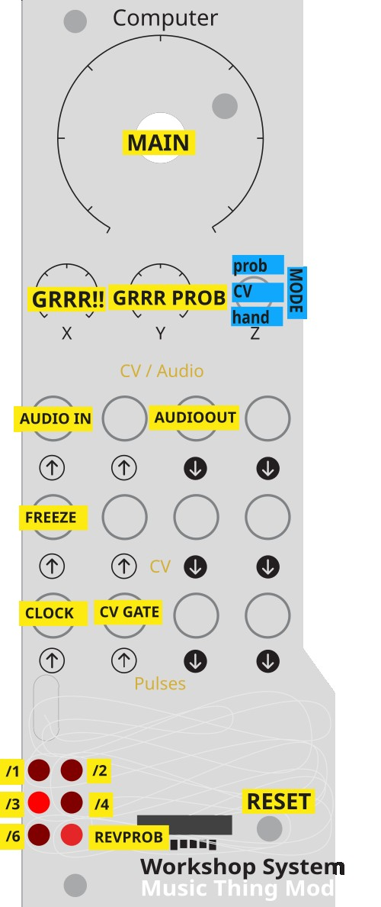

# Glitch — clock-synced beat-repeater for Workshop Computer

A beat-repeater and audio degradation effect. Glitch records incoming audio into a 0.5s circular buffer and replays a ratcheted sub-slice of the last beat, with optional reversal and lo-fi degradation.

## Installation

1. Workshop computer connected via (data compatible) USB cable
2. Power cycle
3. Hold secret button under knob on Workshop Computer, press reset button on WC, release secret button  - it mounts as a drive called RPI-RP2
4. Drag and drop `glitch.uf2` onto the drive
5. The Workshop Computer reboots automatically and Glitch is running

## Inputs

| Jack | Function |
|------|----------|
| Audio In 1 (top input) | Main audio input |
| Pulse In 1  (bottom input) | Clock input — rising edge sets beat length (max 0.5s) |
| Pulse In 2 | External gate (Switch MID mode only) |
| CV In 1 (middle input) | Freeze — above ~0V stops recording, loops frozen content |

## Outputs

| Jack | Function |
|------|----------|
| Audio Out 1 | Main output |
| Audio Out 2 | Identical to Out 1 |

## Controls

**Main Knob — Ratchet Zone + Probability**
Divided into 5 zones selecting ratchet division ÷1 / ÷2 / ÷3 / ÷4 / ÷6.
Position within each zone sets reverse probability threshold. Final LED brightness shows current probability for reverse/glitch.

**Knob X — Degradation Amount**
Bitcrushing (reduces bit depth) and decimation (reduces sample rate) applied together. At zero, bypassed completely.

**Knob Y — Degradation Probability**
How often degradation fires per slice. CCW = never, CW = always.

**Switch — Glitch Trigger Mode**

| Position | Mode |
|----------|------|
| UP (latching) | Probabilistic — glitch fires randomly based on Main Knob reverse/threshold |
| MID | External gate — glitch while Pulse In 2 is HIGH |
| DOWN (momentary) | Force — always glitch |

When not glitching, live audio passes through unaffected.

## LEDs

| LED | Function |
|-----|----------|
| 0–4 | One lit = current ratchet zone (÷1 through ÷6) |
| 5 | Brightness = reverse probability threshold |

## Quick start

1. Patch a clock into Pulse In 1 and audio into Audio In 1
2. Set Switch DOWN — you should hear the beat repeating immediately
3. Turn Main Knob clockwise through the zones to hear higher subdivisions
6. Move Switch UP and use the probability threshold within each zone
7. Bring up Knob X for degradation, Knob Y to control how often it applies
8. Patch a gate into CV In 1 to freeze the buffer

Full source and documentation: https://github.com/uglifruit/Workshop_Computer/tree/main/Demonstrations%2BHelloWorlds/PicoSDK/ComputerCard/examples/glitch
