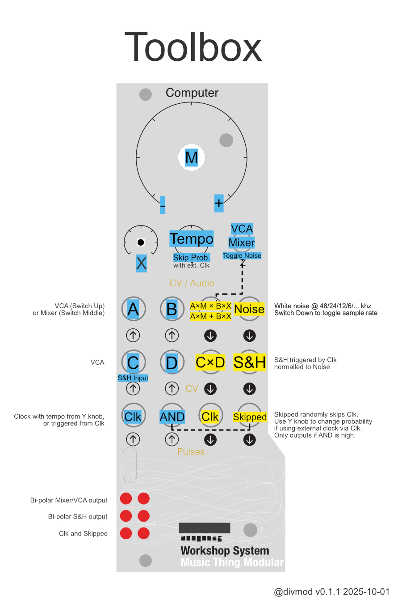

Toolbox
=======

Toolbox is a program card for the Modular Music Thing Workshop System.

It's inspired by the utility section of the 0-Coast. It has a mixer/VCA with attenuverter, a second simple VCA, S&H, clock generator, clock with probability and a noise source with different types of noise (different sampling rates).

Installation
------------

See dist/ for pre-compiled .uf2 images.

Source
------

https://github.com/olt/toolbox

Thanks
------

Thanks to TomWhitwell for building the Workshop System and chrisgjohnson for ComputerCard.
